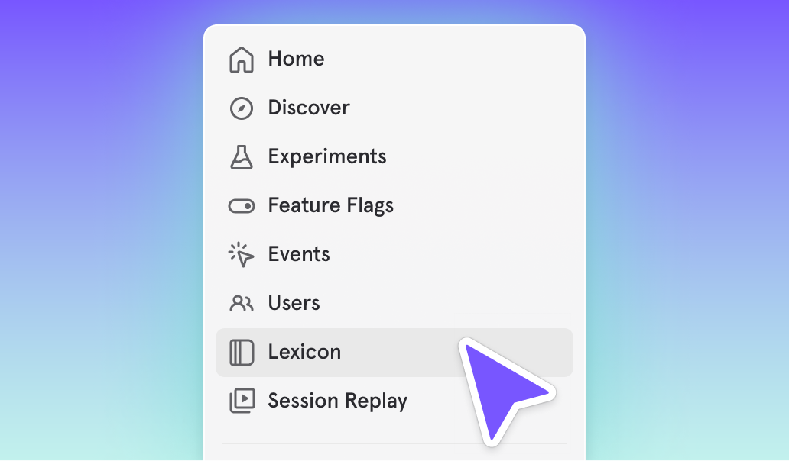

# Cohorts now in Lexicon
_2025-09-08_

Cohorts have now been integrated into Lexicon, making it easier to manage and reference them alongside your other saved definitions like metrics, custom events, and custom properties.
