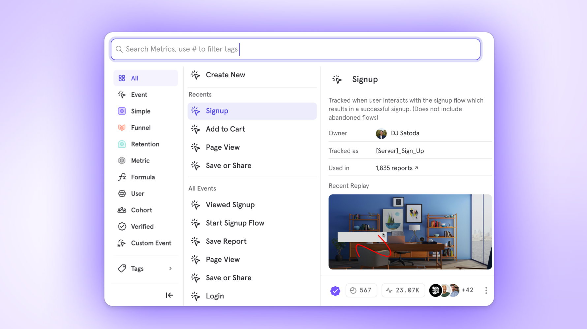

# Session Replay automatically appears in Event Metadata
_2025-09-22_

Event details now include relevant Session Replays directly in Query Builder, Lexicon, and Event pages.

**Why this matters**: Understanding the full context of when and where events occur just got much easier. Instead of manually connecting events to session replays, you'll automatically see the relevant replay footage right alongside your event data.

**What you'll see**: When exploring any event, relevant Session Replays will appear directly in the event details view, giving you immediate visual context for user behavior.

This enhancement makes Session Replay a powerful tool for data governance, helping teams understand their data with less manual work and more confidence.

For more details on this feature, see [Session Replay in Event Metadata](https://app.gitbook.com/s/qGpd1uH02qXOCsOiKqLX/data-governance/lexicon#session-replay-in-event-metadata).
