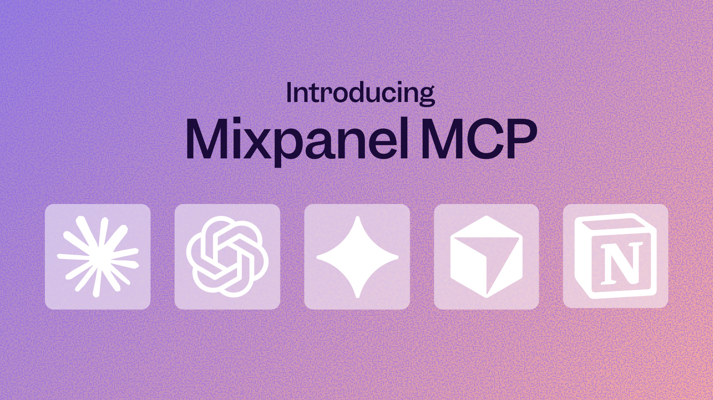

# Mixpanel MCP: Talk to Your Data
_2026-03-24_

Mixpanel MCP brings your product data into the AI tools you already use - Claude, ChatGPT, Gemini, Cursor, Notion, and more. Ask questions in natural language, get answers backed by real data, and take action without switching context.

[Connect your first AI tool →](https://docs.mixpanel.com/docs/mcp)

## What you can do

- Build boards and reports in natural language. Ask a question, get an answer — and a Mixpanel report to go with it.
- Combine behavioral data with qualitative context in a single conversation. Pull up a specific user's replays alongside their event history to understand not just *what* they did, but *how* they experienced it.
- Project Owners and Admins can manage event and property metadata directly through MCP — generating descriptions, verifying data, tagging events, and hiding or dropping properties at scale.

## Try these prompts

- *"In the last three months, which channels have driven the most new users?"*
- *"User X submitted negative feedback on [date]. Analyze their session replays to understand what happened."*
- *"Show me signup conversion rates by acquisition source for the last 30 days."*
- *"Generate event descriptions for all of my events in Lexicon."*

[Learn more about Mixpanel MCP →](https://mixpanel.com/blog/mixpanel-mcp/)
