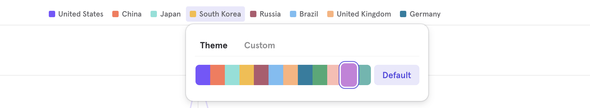

# Filter at item level
_2025-11-13_

Mixpanel now allows you to choose “Matching items” to filter and aggregate only the list elements that meet your condition. Previously, when filtering on list properties like cart, filters used to apply to the entire list — not the individual items inside it. For example, if you filtered for cart.category = Garden, Mixpanel would include the entire cart’s revenue if just one item was from Garden, even if the rest were not.

For example, if you filter on cart.sale_price > 25 and were aggregating by taking the sum of cart.price then the sum would only be on elements that have cart.sale_price > 25.

<VideoButtonWithModal src="https://www.loom.com/embed/164cee809f034b6cb8db3e67adfd3d71" />
