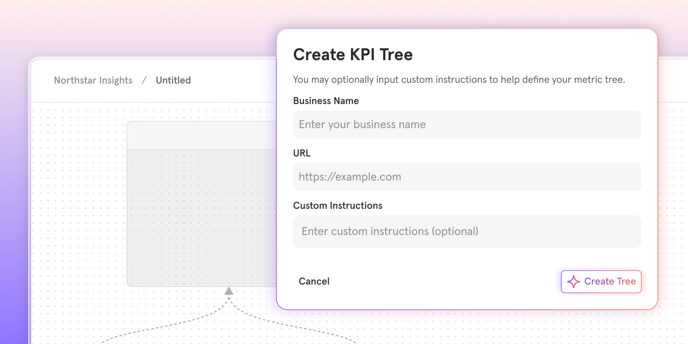

# Metric Trees: Build your first draft instantly with AI
_2026-03-12_

Metric Trees are a structured way to map how your business actually grows, connecting your north star metric to the bets, drivers, and inputs that move it. [Learn more about Metric Trees →](https://mixpanel.com/blog/mixpanel-metric-trees/)

AI Metric Trees gets you to a strong, structured first draft fast, so you can spend less time on setup and more time turning strategy into action. Just provide your company website and a bit of context, and AI handles the rest.

## With AI Metric Trees, you can:

- **Discover metrics you might miss:** Surface drivers, bets, and input metrics you may not have considered, organized around your growth model
- **Start in seconds:** Just enter your company website and an optional description of your business or growth focus
- **Get a thoughtful structure:** Receive a first draft with your north star, outputs, strategic bets, and input metrics
- **Make it yours:** Edit the structure and connect nodes to your real Mixpanel metrics

Generate your first AI Metric Tree and turn a blank canvas into a working foundation. [Learn more →](https://app.gitbook.com/s/qGpd1uH02qXOCsOiKqLX/metric_tree#option-build-with-ai)

**Note:** Metric Trees are available as an add-on for Enterprise customers.

AI Metric Trees does not use your Mixpanel data. Generation is powered by OpenAI and based on industry best practices, common growth models, and the context you provide.
