# Changelog



## Testing UI initiated updated

This post is made from the UI



## Audit Log: Track activity across your organization and projects

Monitor security, troubleshoot issues, and maintain compliance with activity tracking for your organization and projects.

<a href="2026-04-06-audit-logs.md" class="button secondary">Read more</a>



## Mixpanel MCP: Talk to Your Data

Connect Mixpanel to Claude, ChatGPT, Gemini, Cursor, Notion, and more. Ask product questions, build dashboards, explore Session Replays, and manage Lexicon — all from the tools you already use.

<a href="2026-03-24-mixpanel-mcp.md" class="button secondary">Read more</a>



## Feature Flags + Experiments: Now on Go and Flutter

Feature Flags and Experiments are now supported in Go (server-side) and Flutter (client-side) SDKs.

<a href="2026-03-13-go-flutter-feature-flags.md" class="button secondary">Read more</a>



## Metric Trees: Build your first draft instantly with AI

Enter your website, add context, and generate a structured Metric Tree tailored to your business.

<a href="2026-03-12-metric-trees-ai.md" class="button secondary">Read more</a>



## Feature Flags: Target users using real-time behavior with Runtime Events

Target feature variants based on what users do, not just who they are.

<a href="2026-03-03-runtime-events.md" class="button secondary">Read more</a>



## Feature Flags: Exposures on User Profiles

See which feature flags a user was exposed to — and which variant they saw — directly on their profile.

<a href="2026-02-27-feature-flags-user-profiles.md" class="button secondary">Read more</a>



## Security Protocol Update: Phasing Out TLS 1.0 and 1.1

Starting April 2026, we will be deprecating support for legacy TLS 1.0 and 1.1 protocols and adopting CNSA 2.0 cryptographic algorithms across our APIs and web app.

<a href="2026-02-26-tls1011-deprecation.md" class="button secondary">Read more</a>



## AI-Powered Event Suggestions for Templates

We’ve introduced AI-Powered Event Suggestions for Templates to help streamline the process of mapping your events to templates, reducing guesswork and saving time during setup.

<a href="2026-02-24-ai-event-suggestions.md" class="button secondary">Read more</a>



## SSO, Data Views, and Sensitive Data Classification now available on Growth Plans

Growth customers now have access to powerful security and governance capabilities that give teams more control, protection, and flexibility as they scale.

<a href="2026-02-24-growth-plan-sso-data-views.md" class="button secondary">Read more</a>



## Postgres Connectors now in Public Beta

We’re pleased to announce the Postgres Connector, now available in Public Beta — a simpler way to bring your transactional data into Mixpanel.

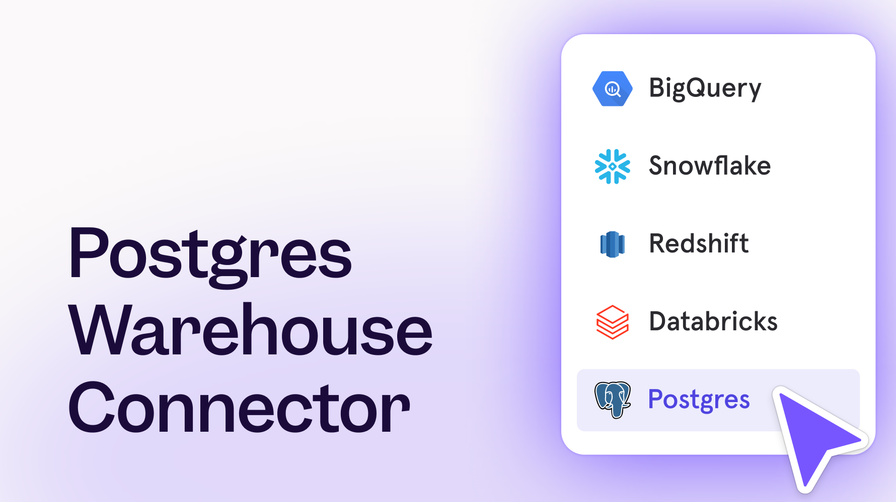

<a href="2026-02-24-postgres-connector.md" class="button secondary">Read more</a>



## Deprecation Notice: Legacy US-to-EU Data Forwarding ends July 2026 for EU Projects

Starting July 2026, we will be fully retiring the legacy US-to-EU Data Forwarding Service for EU Projects

<a href="2026-02-20-eu-forwarding-deprecation.md" class="button secondary">Read more</a>



## Feature Flags — Group Cohort Targeting

Target via group cohorts — cohorts of companies, organizations, or any data group entity — for precise B2B rollouts.

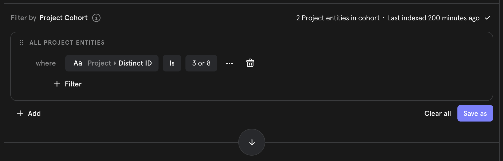

<a href="2026-02-17-group-cohort-targeting.md" class="button secondary">Read more</a>



## Custom Alerts via webhook

Custom Alerts can now send notifications via webhooks, enabling you to integrate Mixpanel alerts with any third-party platform or custom system in your stack.

<a href="2026-01-30-webhook-alert.md" class="button secondary">Read more</a>



## Annotations Timeline: Visualize Your Business Context

A new timeline visualization for annotations that shows how different event types align across your data, with interactive exploration and tag-based filtering.

<a href="2026-01-28-annotations-timeline.md" class="button secondary">Read more</a>



## Data Volume Monitoring Default On for New Enterprise Customers

Data Volume Monitoring is now on be default for new enterprise customers. Enterprise projects are opted into this system, which automatically monitors and detects sudden, drastic changes in event volume and notifies admins for corrective action.

<a href="2026-01-27-dvm-default-on.md" class="button secondary">Read more</a>



## Retiring /decide Endpoint Used in Older Mixpanel SDK Versions

Starting April 2026, we will be fully retiring the /decide endpoint, which we began deprecating in 2022. Newer SDK versions no longer rely on it.

<a href="2026-01-26-decide-deprecation.md" class="button secondary">Read more</a>



## Mixpanel Data Inspector, now available for all Mixpanel JavaScript SDK users

Debug and validate your Mixpanel tracking implementation directly in your browser.

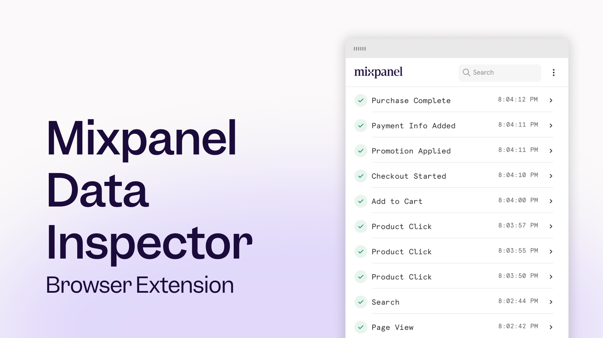

<a href="2026-01-20-mixpanel-data-inspector-v2.md" class="button secondary">Read more</a>



## Feature Flagging: Runtime Targeting

Target feature rollouts using live application context evaluated at runtime.

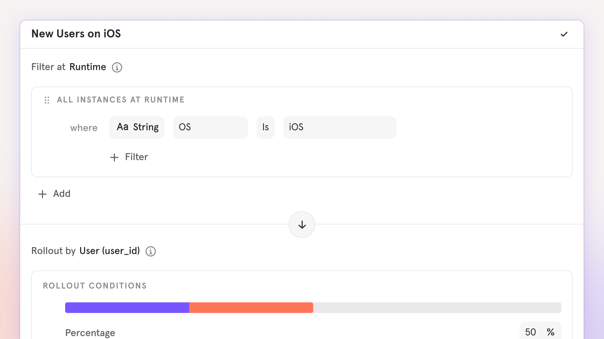

<a href="2025-12-22-runtime-targeting.md" class="button secondary">Read more</a>



## Updated Date Range and Metric Block Guardrails for Insights Reports

Updated Guardrails for Insights Reports, covering Date Range constraints for 'All Events' and Line/Column charts, as well as Metric Block Limits.

<a href="2025-12-17-date-range-limits.md" class="button secondary">Read more</a>



## Dynamic Config for Flexible Feature Rollouts

Target feature rollouts using live application context evaluated at runtime.

<a href="2025-12-11-dynamic-config.md" class="button secondary">Read more</a>



## Expanded regional support for MCP

MCP Support for India and EU Projects

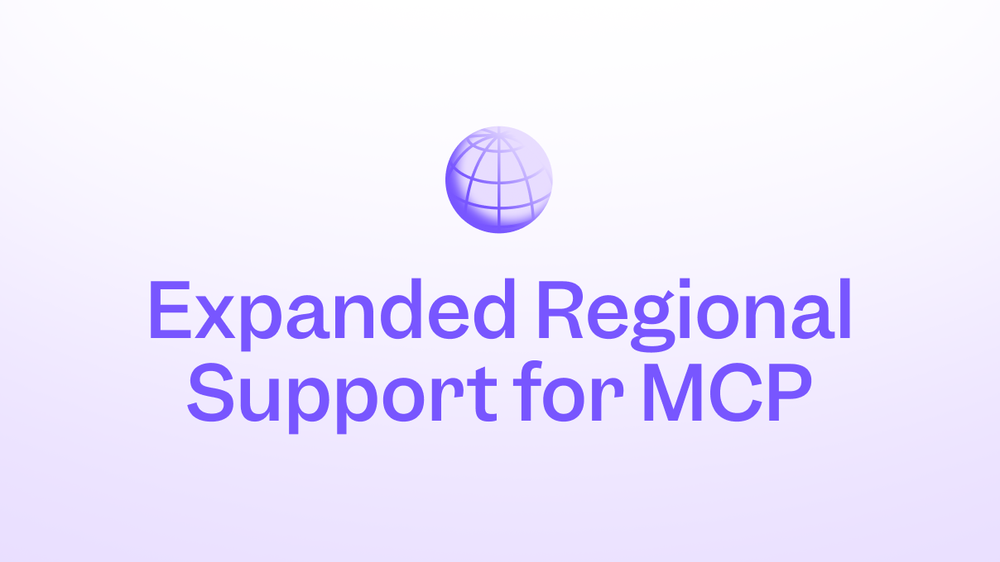

<a href="2025-11-20-mcp-in-eu.md" class="button secondary">Read more</a>



## Dynamic Segments

Select between Dynamic and Manual Segments in your reports to control how breakdowns update as your data changes.

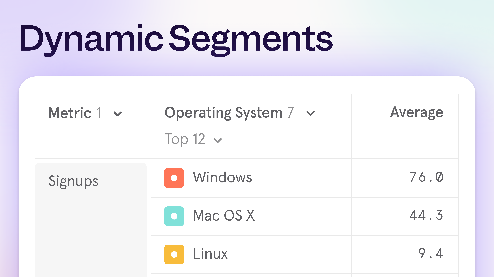

<a href="2025-11-20-topn.md" class="button secondary">Read more</a>



## Session Replay: AI Summaries

Let AI do the watching for you with accurate summaries that help you understand the 'why' instantly.

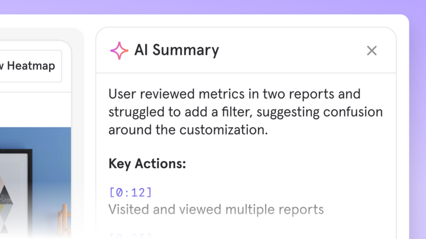

<a href="2025-11-14-session-replay-ai-summaries.md" class="button secondary">Read more</a>



## Session Replay: Frustration Signals

Find user friction fast—view frustration signals in replays and analyze them in your reports.

<a href="2025-11-14-session-replay-frustration-signals.md" class="button secondary">Read more</a>



## Session Replay: Heatmap Comparison Mode

See engagement differences at a glance with side-by-side heatmap comparisons.

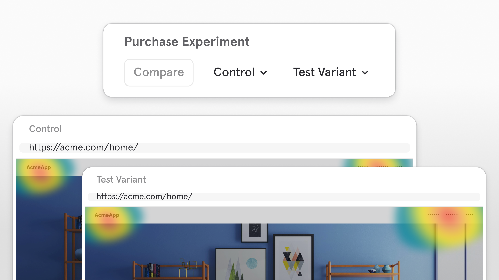

<a href="2025-11-14-session-replay-heatmap-comparison.md" class="button secondary">Read more</a>



## Filter at Item Level

Mixpanel now allows you to select the colors of various segments in your reports. You can choose the color for a particular segment by clicking the legend at the top of the chart. Choose between colors that exist in the theme, or choose an entirely separate color.

<a href="2025-11-13-filter-at-item-level.md" class="button secondary">Read more</a>



## Connect Your LLM Metrics to Mixpanel with Langfuse

We're excited to announce our integration with Langfuse, the open-source LLM engineering platform. Now you can automatically sync your AI application metrics from Langfuse directly into Mixpanel.

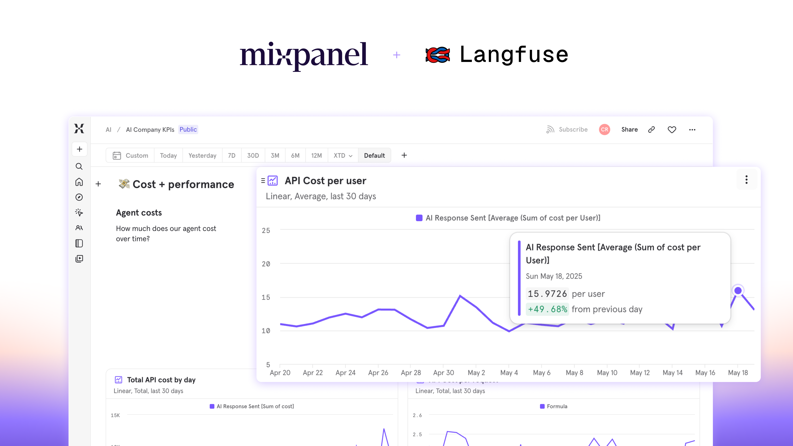

<a href="2025-11-04-langfuse-integration.md" class="button secondary">Read more</a>



## Feature Flagging — Precision control for every rollout

Safely test new features, measure impact, and roll out to the right users — with cohorts, kill switches, and full visibility in one place.

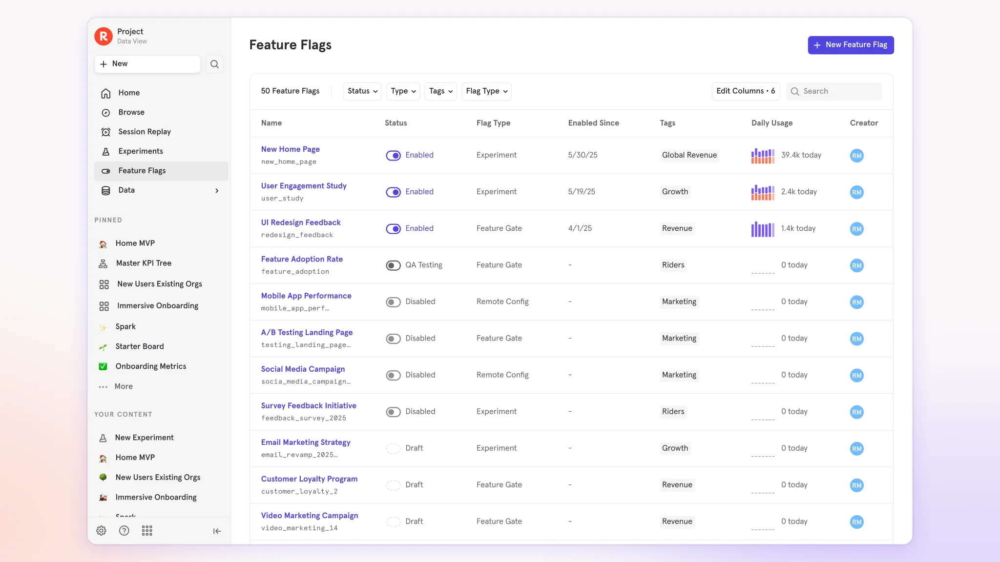

<a href="2025-10-13-feature-flagging.md" class="button secondary">Read more</a>



## Mixpanel Data Inspector Browser Extension

Debug and validate your Mixpanel tracking implementation with real-time event monitoring directly in your browser.

<a href="2025-09-26-mixpanel-data-inspector.md" class="button secondary">Read more</a>



## Session Replay automatically appears in Event Metadata

Review your metrics against different layers of context using Annotation tags and filters.

<a href="2025-09-22-session-replay-in-lexicon.md" class="button secondary">Read more</a>



## Annotations, Now with Tags & Filters

Review your metrics against different layers of context using Annotation tags and filters.

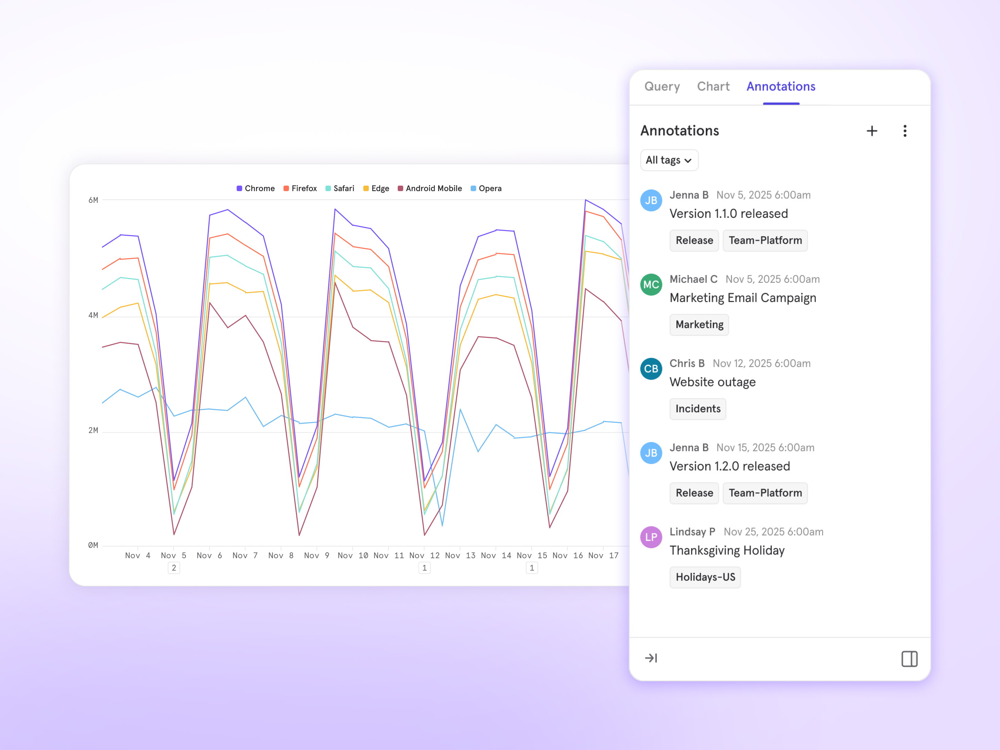

<a href="2025-09-17-annotations.md" class="button secondary">Read more</a>



## Mixpanel Model Context Protocol (MCP) Beta

Talk to your Mixpanel data using natural language. The MCP Server enables AI tools like Claude to directly query your analytics data, democratizing insights across your entire organization.

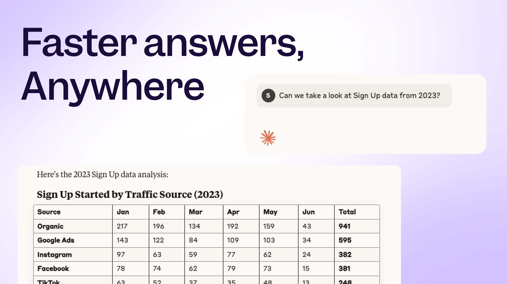

<a href="2025-09-10-mixpanel-mcp.md" class="button secondary">Read more</a>



## Cohorts now in Lexicon

You can find your Cohorts in Lexicon, alongside your other saved definitions like metrics, custom events, and custom properties.

<a href="2025-09-08-cohorts-in-lexicon.md" class="button secondary">Read more</a>



## Updated Billing & Data Retention: Simpler Pricing, Enhanced Privacy

New default Billing and Data Retention policies for simpler pricing and and enhanced privacy and security

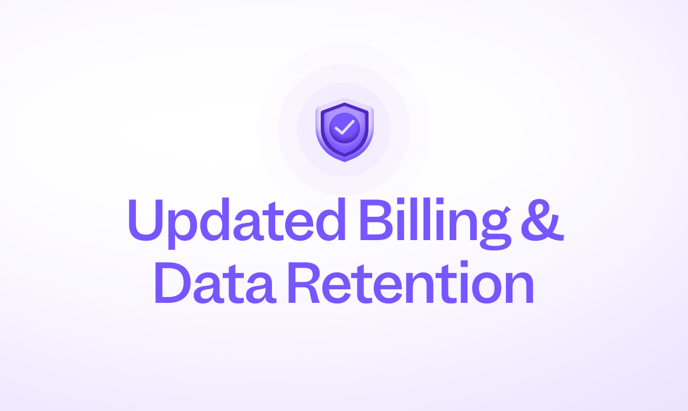

<a href="2025-09-02-data-retention-update.md" class="button secondary">Read more</a>



## Expand Event Images in Context Panel

Expand images in Query Builder's context panel for a clearer view when hovering over event names.

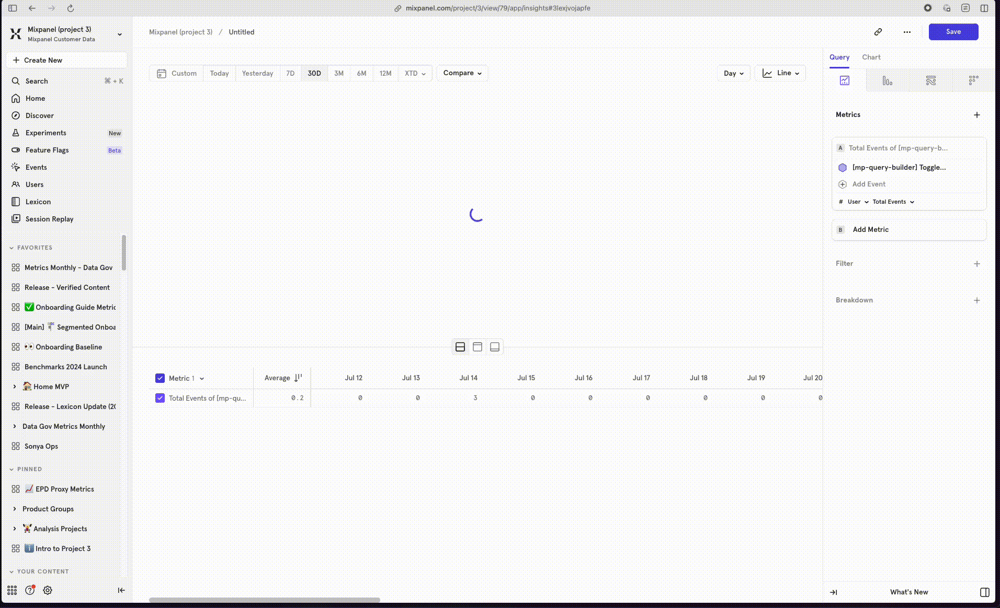

<a href="2025-08-22-image-expansion.md" class="button secondary">Read more</a>



## Growth customers can now buy custom volumes of session replay

Growth customers can now purchase up to 500K monthly / 6M annual replays directly online, in addition to their 20k free replays!

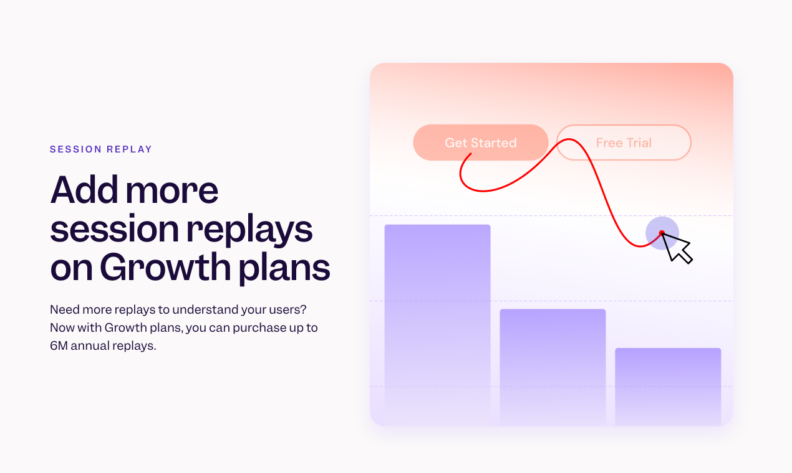

<a href="2025-08-18-growth-custom-session-replay.md" class="button secondary">Read more</a>



## 📱 Session Replay is now available for iOS and Android

Now you can replay user sessions for web and mobile (iOS + Android), all in one unified platform alongside your analytics.

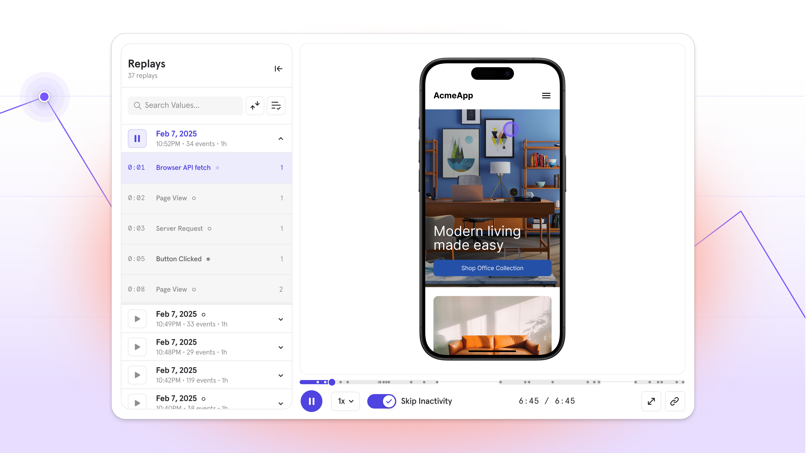

<a href="2025-08-13-mobile-sr.md" class="button secondary">Read more</a>



## Experimentation Reporting 2.0 - Trusted Insights, Maximum Impact

Confidently ship features your users love, with our fully revamped experimentation reporting.

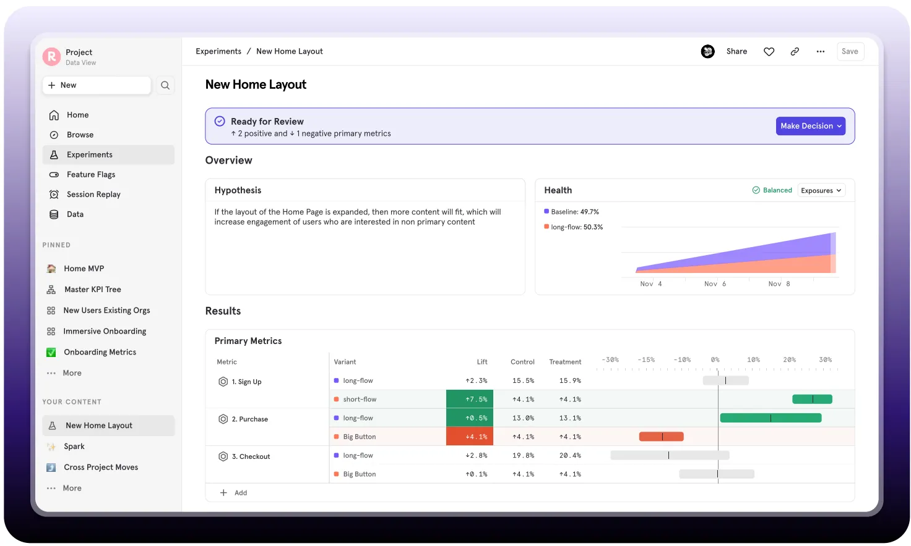

<a href="2025-08-11-experimentation-reporting.md" class="button secondary">Read more</a>



## Metric Trees

Turn strategy into action: Align teams to business goals with a context-rich, interactive, and measurable framework of your metrics.

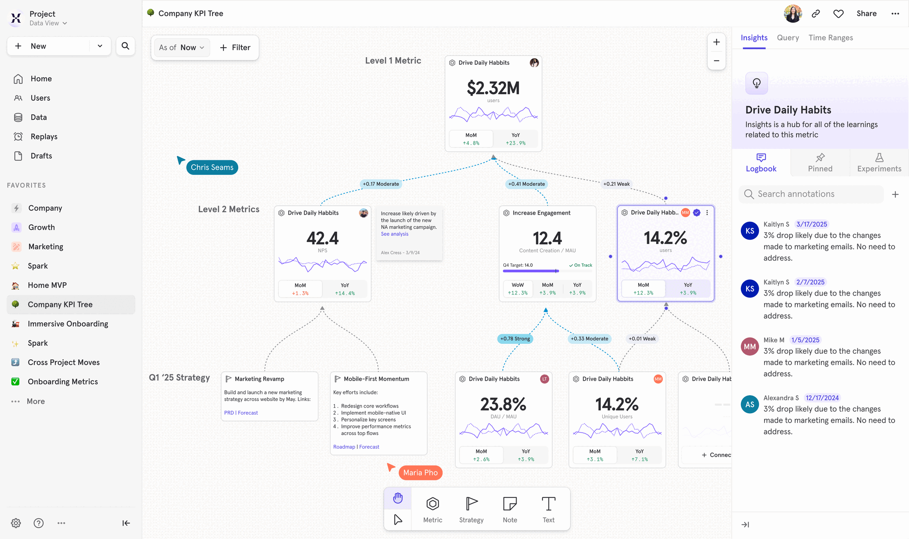

<a href="2025-08-11-metric-trees.md" class="button secondary">Read more</a>



## Save Column Widths in Tables

Save custom column widths in Report and Board tables

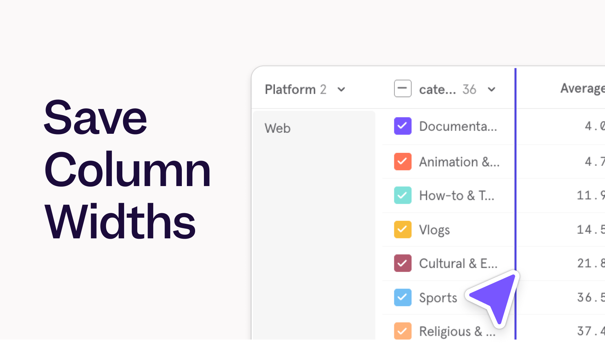

<a href="2025-08-10-save-columns.md" class="button secondary">Read more</a>



## Saved Metrics

A new way to define and standardize your KPIs in Mixpanel.

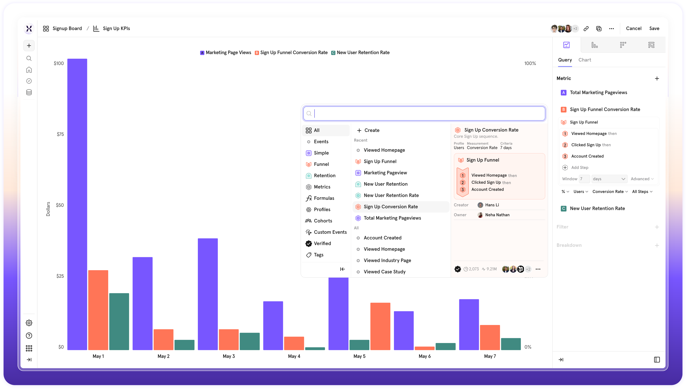

<a href="2025-08-05-saved-metrics.md" class="button secondary">Read more</a>



## Heatmaps for Web

Now available in Mixpanel: Heatmaps, a better way to visually understand your customers.

<a href="2025-07-30-heatmaps.md" class="button secondary">Read more</a>



## Customize Your Project Homepage

Tailor your Mixpanel experience to suit the needs of your organization. Now, project admins can set any Board in the project as the default project homepage.

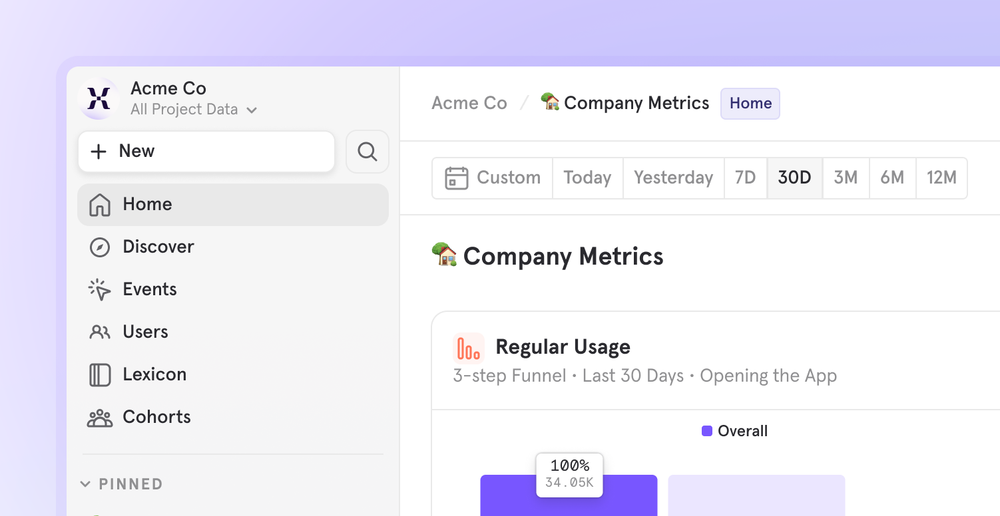

<a href="2025-07-15-homepage-board.md" class="button secondary">Read more</a>



## Track key AI metrics

Mixpanel’s AI Company KPIs template helps you determine which AI metrics to track and how to measure them immediately.

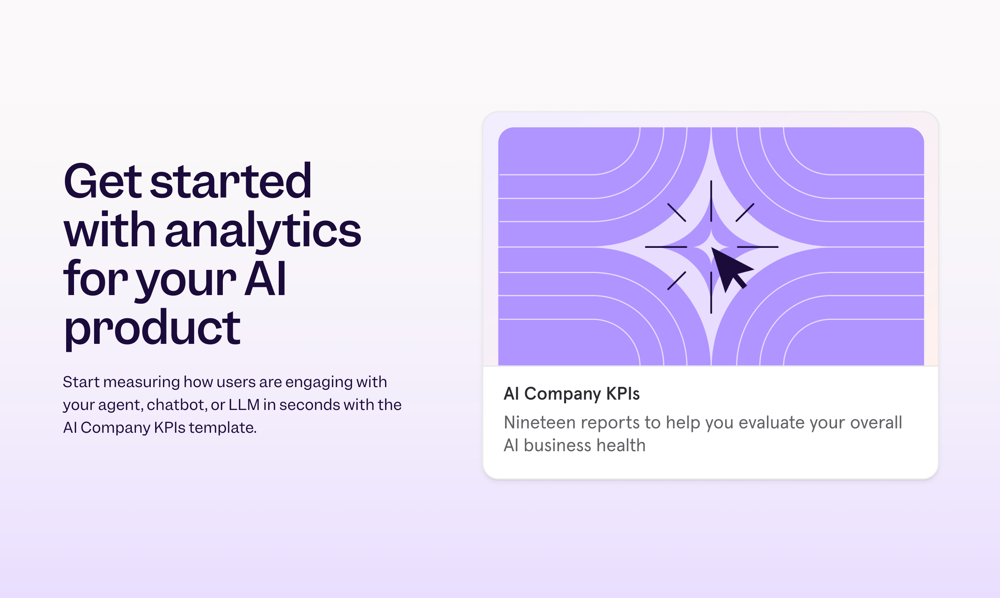

<a href="2025-05-19-AI-company-metrics.md" class="button secondary">Read more</a>



## Optimized Funnel Re-entry

Mixpanel's new funnel re-entry mode guarantees the ability to find a funnel conversion if a conversion exists, irrespective of if it's the user's first or fifth attempt to enter the funnel.

<a href="2025-04-22-optimized-funnel-reetnry.md" class="button secondary">Read more</a>



## Global Sidenav

Mixpanel's new navigation makes it easier to get around and stay in the zone, all while giving you more space to work.

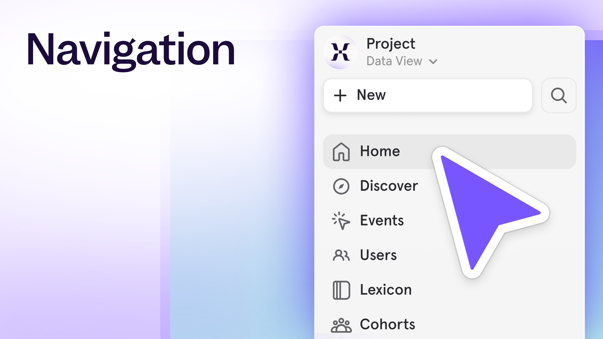

<a href="2025-04-16-global-sidenav.md" class="button secondary">Read more</a>



## Enforce better governance with Data Standards

Data Standards helps you keep your data organized and understandable, by enforcing naming conventions and metadata requirements. Now, teams can easily spot non-compliant events in Lexicon and take action to maintain high data quality at scale.

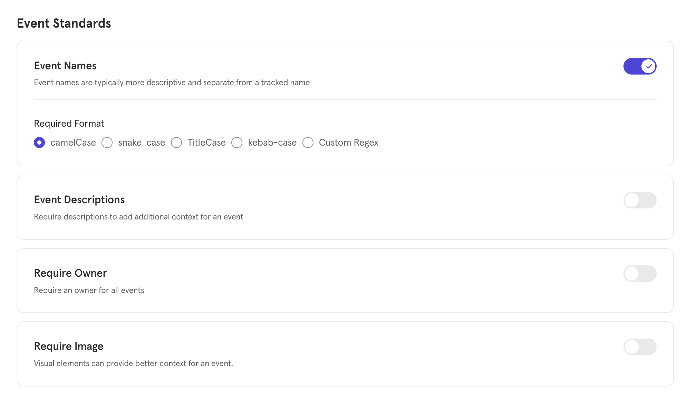

<a href="2025-03-27-data-standards.md" class="button secondary">Read more</a>



## Mirror Sync Mode for Redshift Warehouse Connectors

Mirror is a new mode on Warehouse Connectors that keeps Mixpanel in perfect sync with your warehouse. Any time data is modified in your underlying warehouse table, that change is automatically reflected in Mixpanel through change data capture (CDC). You can iteratively implement, rename or remove columns, or reconcile transactions in your warehouse without any worry of data divergence in Mixpanel. This sync enables accurate analysis for all data types, including business data that changes often like purchases.

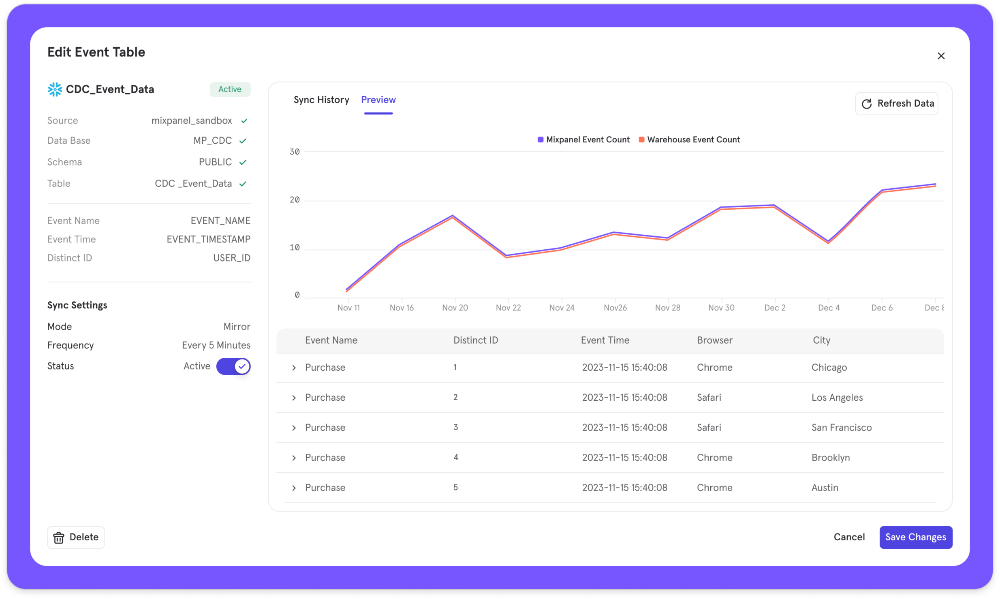

<a href="2025-02-25-mirror-redshift.md" class="button secondary">Read more</a>



## New features for enhanced B2B account analytics!

Two new features built for B2B account analysis are now available for customers with the Group Analytics add-on! You can now improve adoption and reduce churn risk by monitoring strategic accounts with out-of-the-box Account Profiles and activation metrics.

!\[]\(.gitbook/assets/changelog/B2B - Summary.png)

<a href="2025-02-10-b2b-company-analytics.md" class="button secondary">Read more</a>



## Our Growth plan just got 100x more generous

No more feature limits. Get 1M monthly events free on Mixpanel’s Growth plan. Because we're done being part of the unintuitive SaaS pricing doom loop.

<a href="2025-02-04-1million-events-free-on-growth.md" class="button secondary">Read more</a>



## Introducing Autocapture from Mixpanel

Introducing Autocapture from Mixpanel! With just a single code snippet, you can now track common events without custom code, enabling you to get started with analytics in <2 minutes.

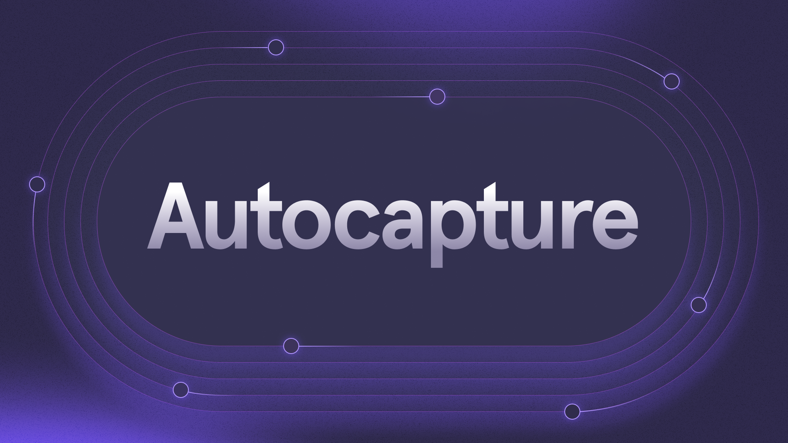

<a href="2025-02-04-autocapture.md" class="button secondary">Read more</a>



## Watch replays for any event — even backend events

Session Replays now work for all your data, not just client-side or front-end events. That means you can jump straight from reports to replays, even for events tracked via APIs, sent from your data warehouse, or sent from the server-side.

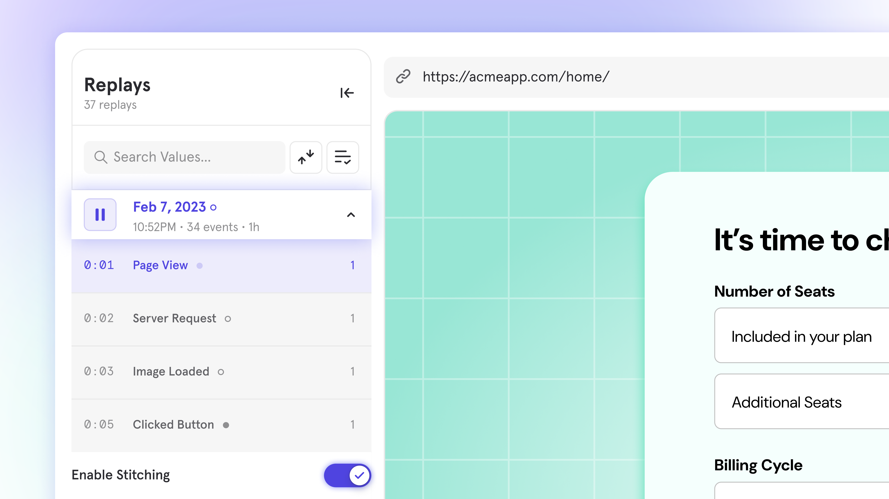

<a href="2025-01-31-server-side-stitching.md" class="button secondary">Read more</a>



## Mixpanel for Startups now provides over $150k in value

The revamped startup program offers eligible companies with complete access to Mixpanel's comprehensive analytics, free for their first year.

<a href="2025-01-21-revamped-startup-program.md" class="button secondary">Read more</a>



## 📱 Session Replay is now available for React Native

Now you can replay user sessions for React Native apps, bringing Session Replay to your cross-platform mobile development workflow.

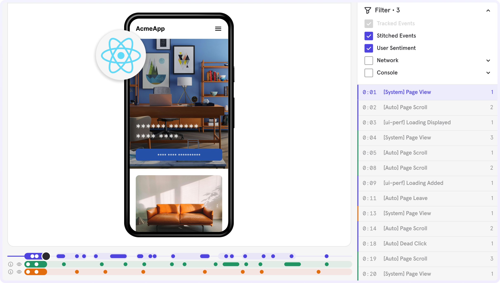

<a href="2026-01-15-react-native-sr.md" class="button secondary">Read more</a>



## Pin Filters to Boards

You can now customize how filters appear on Boards with new settings. Pin a filter to a board for easy access or select the default filter values that should appear for all users.

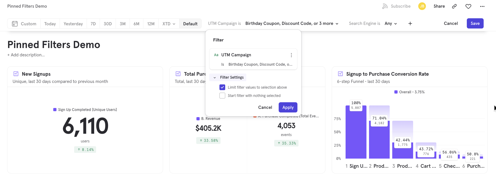

<a href="2025-01-10-pinned-filters.md" class="button secondary">Read more</a>



## Session Replay is now available on Free and Growth plans

Session Replay is now available on all of our latest plans! Customers can update to the latest Free and Growth plans to unlock free monthly replays.

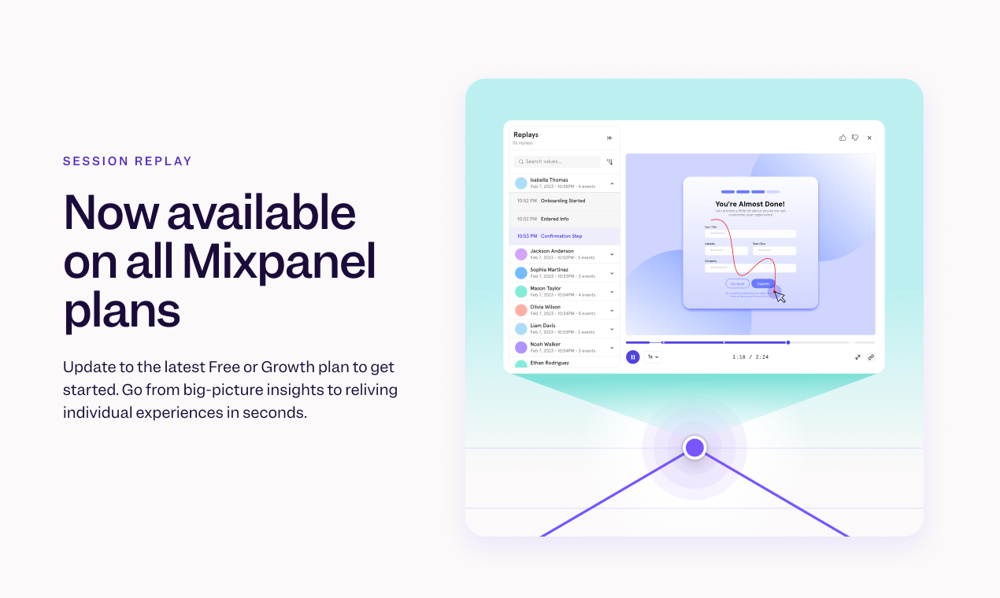

<a href="2024-12-02-freeSRonbaseplans.md" class="button secondary">Read more</a>



## Add verification tags to your data

Governors can now designate metrics, events, and formulas as Verified, adding a verified badge to these items across the platform. Highlighting vetted content can make it crystal clear for your team which metrics are trusted across the organization.

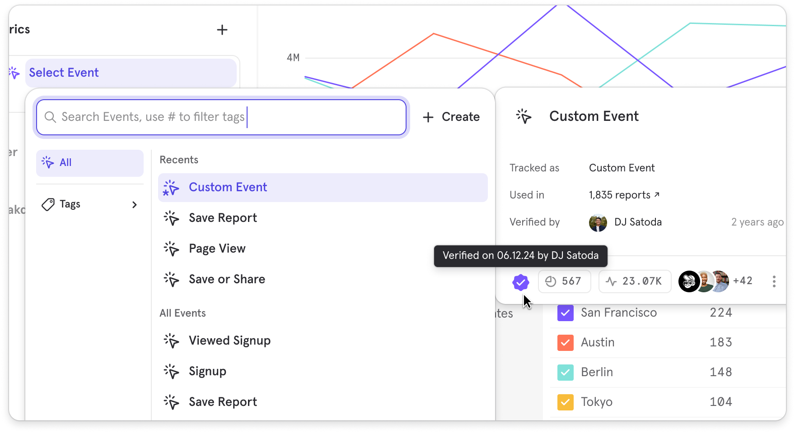

<a href="2024-11-14-verified-content.md" class="button secondary">Read more</a>



## India Data Residency for Mixpanel

Like our EU Data Residency, Mixpanel's India Data Residency helps you process, protect, and manage personal data securely and according to local requirements.

<a href="2024-10-11-india-data-residency.md" class="button secondary">Read more</a>



## Set units for your metrics

Mixpanel now allows you to set the units for each of your metrics. You can set the unit, the precision, and whether or not you want an abbreviated value. This gets updated for tooltips as well as in the table below the chart.

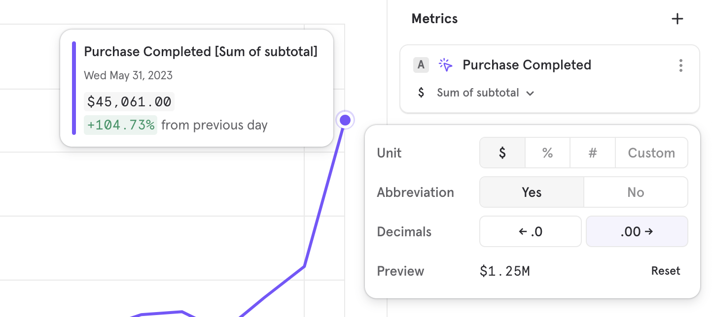

<a href="2024-10-09-metric-units.md" class="button secondary">Read more</a>



## Choose colors for your segments

Mixpanel now allows you to select the colors of various segments in your reports. You can choose the color for a particular segment by clicking the legend at the top of the chart. Choose between colors that exist in the theme, or choose an entirely separate color.

<a href="2024-10-09-segment-coloring.md" class="button secondary">Read more</a>



## Mixpanel Revenue Analytics

Mixpanel now helps you analyze the impact of your product and marketing initiatives on your key company revenue metrics.

<a href="2024-10-08-revenue-analytics.md" class="button secondary">Read more</a>



## Mixpanel in your language

Mixpanel is now available to use in additional languages, including Français, Español, Português, 한국어, 日本語, 繁體中文, 简体中文, and Bahasa Indonesia. You can choose your language from the settings menu in the top right of the page.

<a href="2024-09-23-mixpanel-in-your-language.md" class="button secondary">Read more</a>



## Mixpanel Session Replay is Now Available

Mixpanel Session Replay is officially out of beta! Quickly pinpoint drop-offs in your funnels and instantly dive into replays to understand exactly why users get stuck.

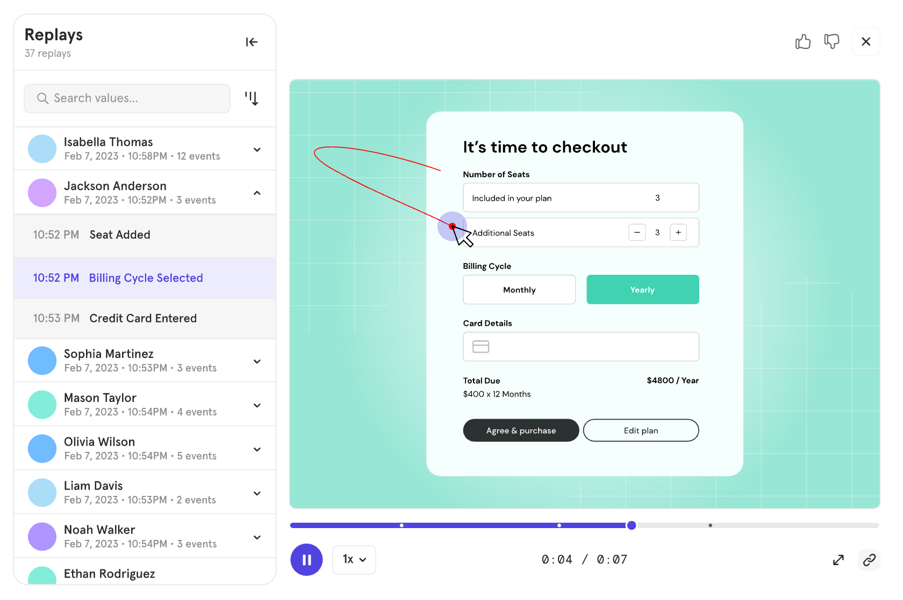

<a href="2024-09-11-session-replay.md" class="button secondary">Read more</a>



## Pick time ranges down to the minute

You choose date ranges that are specified up to the minute. If there's a metric that you want to drill in on for only a few hours, you can set your time range and see only that exact range. This saves you work from having to create a detailed time filter or custom property to do the same thing.

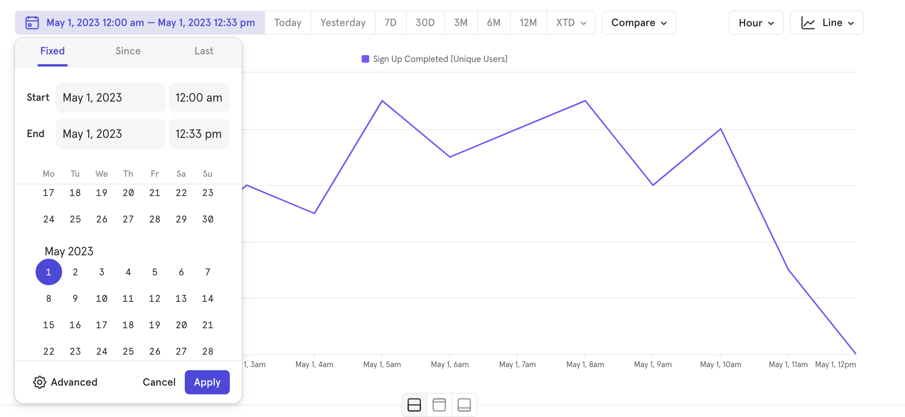

<a href="2024-07-17-minute-time-picker.md" class="button secondary">Read more</a>



## Axis Customization

You can now customize the axes of your charts. Using this, you can build better dashboards and tell the story you want more easily. Any changes you make can be saved and will be reflected on the dashboard. To access these new options, go to the 'Chart' tab of the query builder.

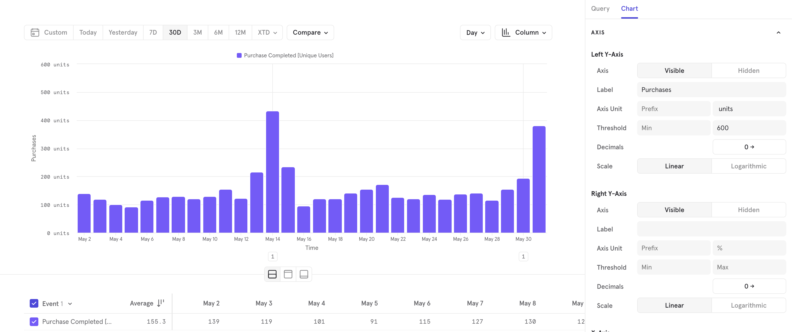

<a href="2024-06-27-axis-customization.md" class="button secondary">Read more</a>



## Color Themes

You can now set the color theme of your charts in Mixpanel. We have a few preset themes for you, but you can also create and save your own theme. You use a different theme for every report, and even have a dashboard with reports using different themes. You'll also be able to set a project wide default for color themes.

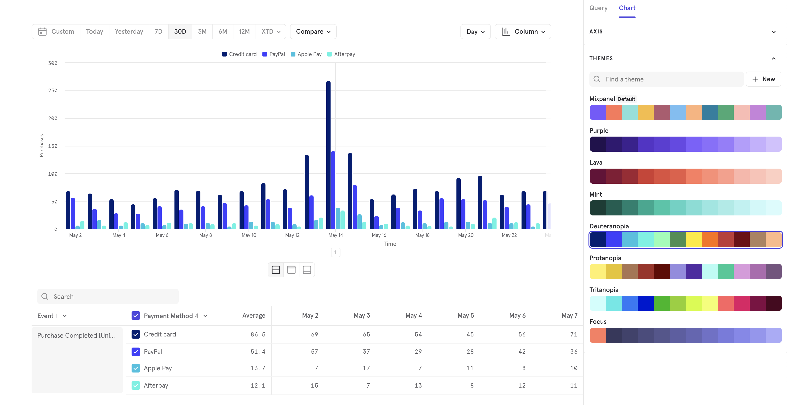

<a href="2024-06-27-color-themes.md" class="button secondary">Read more</a>



## Mirror Sync Mode for Warehouse Connectors

Mirror is a new mode on Warehouse Connectors that keeps Mixpanel in perfect sync with your warehouse. Any time data is modified in your underlying warehouse table, that change is automatically reflected in Mixpanel through change data capture (CDC). You can iteratively implement, rename or remove columns, or reconcile transactions in your warehouse without any worry of data divergence in Mixpanel. This sync enables accurate analysis for all data types, including business data that changes often like purchases.

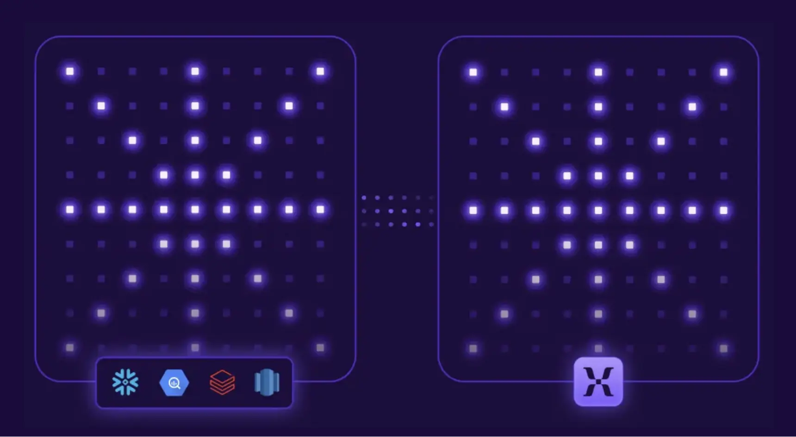

<a href="2024-06-18-mirror-warehouse.md" class="button secondary">Read more</a>



## Know where you are with a persistent navigation panel

Now when switch between Boards or reports, you will always see the side navigation panel and keep your context. Your current Board will also be highlighted on the side as you're viewing a report within a Board. You'll be able to see where you are with respect to your Boards, and easily create a new Board, search, or go to Home.

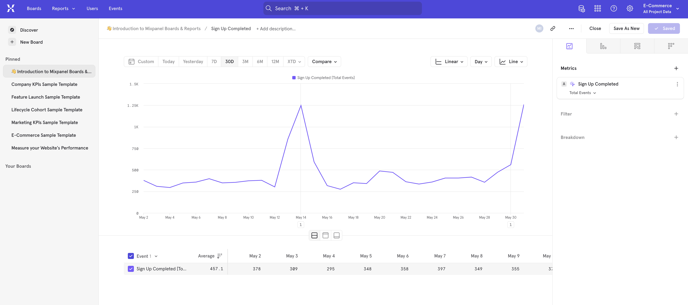

<a href="2024-06-18-persistent-navigation.md" class="button secondary">Read more</a>



## Column Chart Visualization

You can now view your time series as a column or stacked column chart in Insights report.

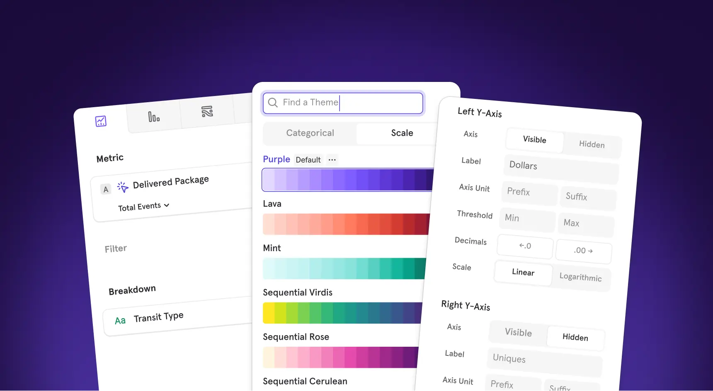

<a href="2024-05-09-column-charts.md" class="button secondary">Read more</a>



## Home

Home is the new landing experience in Mixpanel. It’s for you to jump back into your workflows and get a glimpse into what’s happening across your product and your project in Mixpanel.

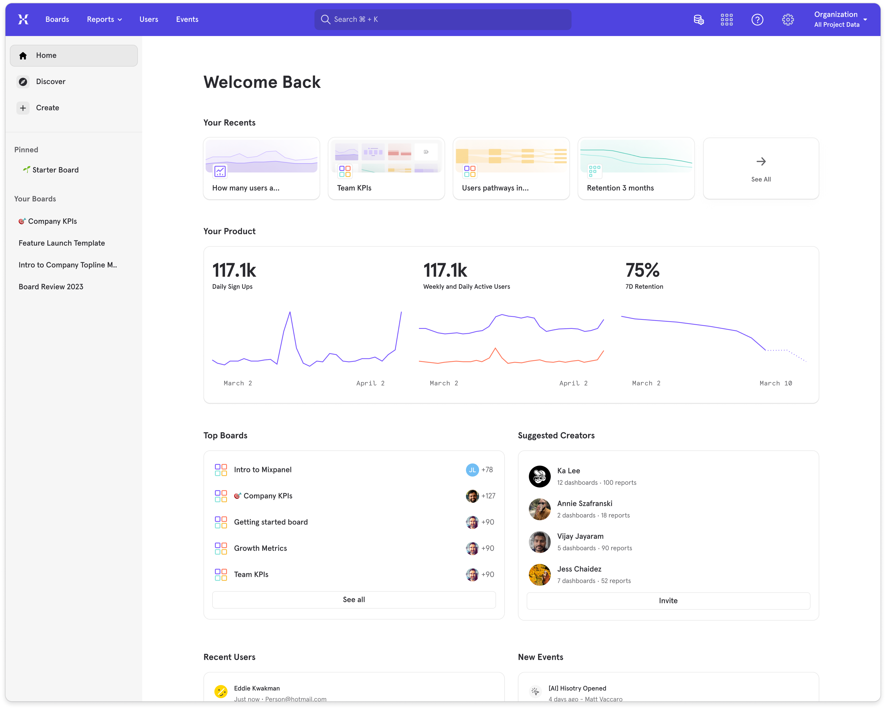

<a href="2024-05-09-home.md" class="button secondary">Read more</a>



## AI Chatbot and Search in Mixpanel Docs

[Link to Demo](https://www.loom.com/share/3407a37ce1634f51b94b380c40c96306)

<a href="2024-04-18-ai-chatbot-search-in-docs.md" class="button secondary">Read more</a>



## Plot Insights, Funnels, and Retention on the same chart

[Link to Demo](https://www.loom.com/share/81c25f63005d4d0da8d06c1558ac1c70)

<a href="2024-04-03-plot-metrics-in-insights.md" class="button secondary">Read more</a>



## Save and Reuse Funnel and Retention Behavior definitions

[Link to Demo](https://www.loom.com/share/e84c62b2454d496b960fb0fdb09b9785)

<a href="2024-04-03-save-funnel-retention-behaviors.md" class="button secondary">Read more</a>



## Ask your questions in natural language with Spark AI

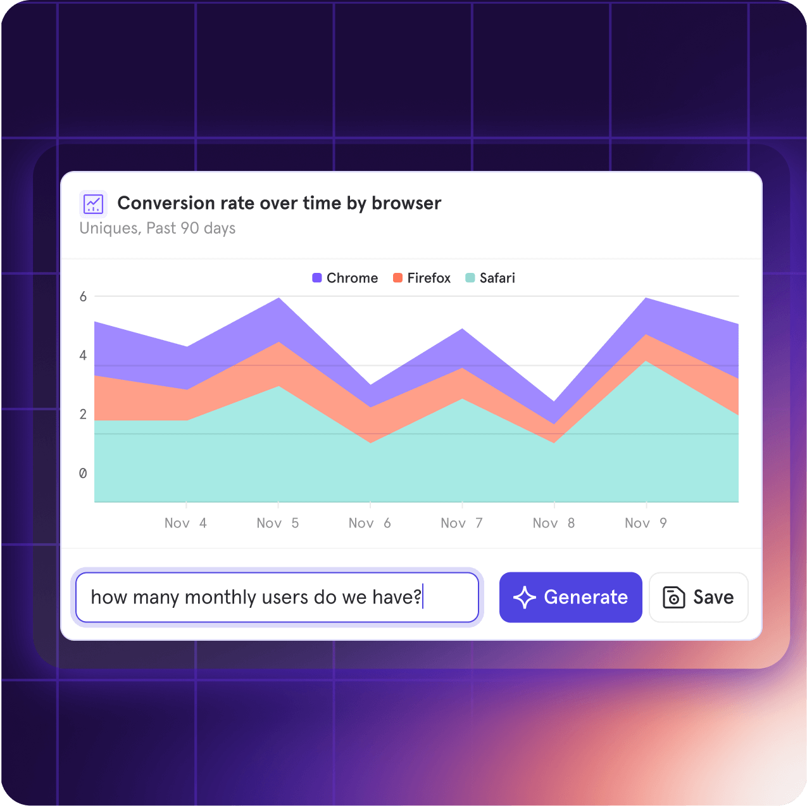

<a href="2024-03-27-spark.md" class="button secondary">Read more</a>



## Merge data from different events on-the-fly with Borrowed Properties

[Link to Demo](https://www.loom.com/share/d45c325a7ee544a9965e90c3a5127257?sid=0cc8f226-72a4-4817-bd6d-13732a3b4237)

<a href="2024-03-14-borrowed-properties.md" class="button secondary">Read more</a>



## See what actions lead to retention with Behavioral Properties in Retention

[Link to Demo](https://www.loom.com/share/dd4042654e6f46039d011a680fe93948)

<a href="2024-03-11-retention-behaviors.md" class="button secondary">Read more</a>



## Subscribe to Boards for ongoing notifications on metrics

Boards are a useful tool to collect a series of reports in one place, but they shouldn't be a set and forget experience. It's important to stay in the loop with how these key metrics are moving.

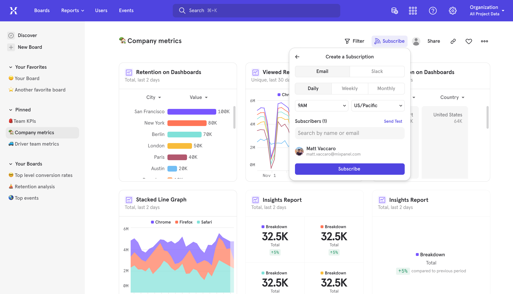

<a href="2024-03-11-sub-to-boards.md" class="button secondary">Read more</a>



## Compare against the best with the Benchmarks 2024 Report

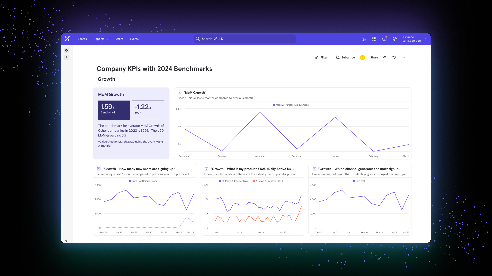

<a href="2024-03-07-benchmark.md" class="button secondary">Read more</a>



## Get alerted when product experiences break

[Link to Demo](https://www.loom.com/share/0284fcd216c74397966996fbb558b053)

<a href="2024-03-05-funnels-alerts.md" class="button secondary">Read more</a>



## Segment users by their behaviors in Funnels

[Link to Demo](https://www.loom.com/share/e6e9806db88b448bb82044033ac052cf)

<a href="2024-03-05-funnels-behaviors.md" class="button secondary">Read more</a>



## Expanded Time To Convert functionality in Funnels

[Link to Demo](https://www.loom.com/share/5150be7a7b194de0ac538ff85c35c3ce)

<a href="2024-03-05-funnels-ttc.md" class="button secondary">Read more</a>



## Measure revenue drop-off at each funnel step

[Link to Demo](https://www.loom.com/share/e041e17a02d4429b84304ba0ce1345dc)

<a href="2024-03-05-revenue-conversion.md" class="button secondary">Read more</a>



## Set your visualization to WTD/MTD/QTD/YTD

Mixpanel now supports the ability to set the timeframe of your visualization by “X”-to-date:

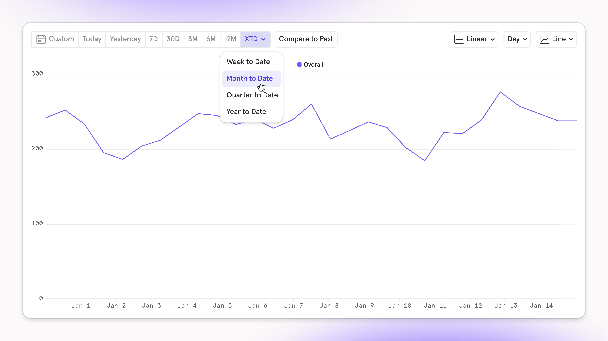

<a href="2024-03-05-xtd.md" class="button secondary">Read more</a>



## Track your ad performance metrics in less than 10 minutes

Note: this is our latest offering for [Mixpanel Marketing Analytics](https://mixpanel.com/m/mixpanel-marketing-analytics/)

<a href="2024-02-27-ad-performance.md" class="button secondary">Read more</a>



## New Experience and Features in Funnels and Retention

Mixpanel's funnels and retention reports are where you can see user behavior through a series of events. With our next set of changes, we are making funnels and retention reports more powerful, while making them easier to use and keeping our controls in a place consistent with insights.

<a href="2024-02-13-new-funnels-retention.md" class="button secondary">Read more</a>



## Be notified of major shifts in data volume

[Link to Demo](https://www.loom.com/share/eae9ce08b2e94104afe2f41b634d82ea)

<a href="2024-02-08-data-volume-monitoring.md" class="button secondary">Read more</a>



## Event Approval now supports new property detection

Event Approval now supports notifications for new properties on existing events, in addition to notifications for newly tracked events. You can turn on new property detection in project settings. For more information, check out our [docs](https://docs.mixpanel.com/docs/data-governance/event-approval).

<a href="2024-01-25-new-property-detection.md" class="button secondary">Read more</a>



## Easier to use Event & Property Menus

[Link to Demo](https://www.loom.com/share/2ebb3ec708334fd69e27130cf6bfc3db)

<a href="2024-01-17-new-menus.md" class="button secondary">Read more</a>



## Find the right data more easily with Event Context

[Link to Demo](https://www.loom.com/share/f7e0cbde17d04c6eac858f3d7e69aacf?sid=ef579161-ad52-46f4-96e9-a5ad2c500dcf)

<a href="2023-11-22-event-context.md" class="button secondary">Read more</a>



## Manage channel definitions with Channel Classifier

[Link to Demo](https://www.loom.com/share/0e773e307f574f398e5a3609462cfa01)

<a href="2023-11-16-channel-classifier.md" class="button secondary">Read more</a>



## Measure how long users view webpages

[Link to Demo](https://www.loom.com/share/19461fe6014c48c3806721e735daac30?sid=3b6a69c3-3618-4300-8ce8-25d437ba32d4)

<a href="2023-11-16-duration.md" class="button secondary">Read more</a>



## Track your Web Analytics on one Board

[Link to Demo](https://www.loom.com/share/a8940230695943ecb743dda421fef673)

<a href="2023-11-16-web-analytics.md" class="button secondary">Read more</a>



## Save Formulas for reuse and metric standardization

[Link to Demo](https://www.loom.com/share/8579c1ac4e2a4b06a0a12e4416b07918?sid=7a3ccce7-5513-455f-8397-fb1269c807f1)

<a href="2023-11-09-saved-formulas.md" class="button secondary">Read more</a>



## Lookup Tables Import now supported with Warehouse Connectors

Today, all customers can use Warehouse Connectors to import Lookup Tables from their warehouse. For a list of supported warehouses, check out this [list](https://app.gitbook.com/s/qGpd1uH02qXOCsOiKqLX/data-in/tracking-methods/warehouse-connectors). This capability allows you to periodically enrich Mixpanel with data from your source-of-truth.

<a href="2023-11-07-lookup-tables-warehouse-connectors.md" class="button secondary">Read more</a>



## Databricks now supported with Warehouse Connectors

[Link to Demo](https://www.loom.com/share/56a21b31e75342498317cbb6f31285eb?sid=5cd6c82c-87d4-48c3-9f19-1e44b8327923)

<a href="2023-11-08-databricks-connector.md" class="button secondary">Read more</a>



## Count a Unique user towards one segment

In the past, when breaking down an event counted by _Uniques_, you often came across this question: why is the sum of users in segments not equating the the overall uniques?

<a href="2023-11-02-uniques.md" class="button secondary">Read more</a>



## Iterate on existing reports faster than ever with a new workflow

[Link to Demo](https://www.loom.com/share/9d992239e7ba498a99ae3442cd639b8d?sid=abff6216-3323-4811-9d67-bb31037d87c9)

<a href="2023-10-20-report-iteration-workflow.md" class="button secondary">Read more</a>



## Redshift now supported with Warehouse Connectors

[Link to Demo](https://www.loom.com/share/76f4658dd850457e9634c706ee0d9430?sid=2cc72a2a-ca9b-406e-80d3-86500a29f48e)

<a href="2023-10-04-redshift-connnector.md" class="button secondary">Read more</a>



## Workflow Improvements in Insights Report

[Link to Demo](https://www.loom.com/share/f0d467f6b10247838f2edac6e8e4fca4)

<a href="2023-09-25-2023-insights.md" class="button secondary">Read more</a>



## Plot Profile Metrics alongside other Metrics

Profiles have always been a powerful tool to slice & dice your user-base to learn key insights about where your users are from, what browser they’re using, or any other property. The new functionality we’ve added to Profiles allows for more depth of analysis - specifically, you can compare these metrics alongside other events in the same view.

<a href="2023-09-25-profiles.md" class="button secondary">Read more</a>



## Formulas now behave as metrics

Formulas have forever been an integral part of Mixpanel to create new metrics (Bounce Rate, Conversion) from existing data — and now, we’ve improved the usability of Formulas to help you encounter less roadblocks and speed up your analysis workflow.

<a href="2023-09-19-formulas.md" class="button secondary">Read more</a>



## Focus on the right metrics with Hide/Unhide

It’s now possible to hide or unhide events from your visualization so you can focus on the metrics that matter.

<a href="2023-09-19-hideunhide.md" class="button secondary">Read more</a>



## Automagically answer questions with Starter Board

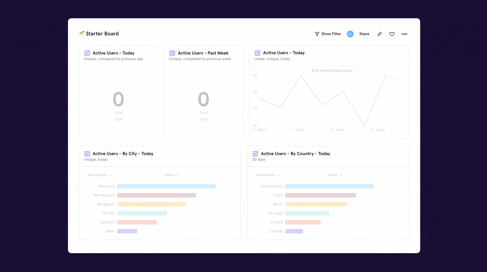

<a href="2023-09-07-starter-board.md" class="button secondary">Read more</a>



## Finding a template is easier than ever

Templates are supposed to make your life easier, but we heard that figuring out how to access templates was confusing and difficult. So we’ve rolled out phase one of our plan to make finding templates easier, starting with when you click the New Board button.

<a href="2023-09-07-template-discovery.md" class="button secondary">Read more</a>



## Warehouse Connectors now supports importing Users & Groups

You can now use Warehouse Connectors to import User and Group tables from your warehouse. With this capability, you can extend source-of-truth data about users and groups into Mixpanel for analysis.

<a href="2023-09-05-warehouse-connectors-users-groups.md" class="button secondary">Read more</a>



## Manage implementations more easily with event metadata

[Link to Demo](https://www.loom.com/share/d68d2f2f213144d8817d414eddd88f46?sid=04b74494-7aea-4eb7-aeb3-943e41ac7ec3)

<a href="2023-08-30-event-metadata.md" class="button secondary">Read more</a>



## Fluid, flexible organization with Boards on Boards

You can now nest Boards within other Boards for more flexible, contextual organization of your analyses.

<a href="2023-08-29-boards-on-boards.md" class="button secondary">Read more</a>



## Find what's impacting conversion with Attribution

Your users will experience a multitude of touchpoints along their journey to a conversion moment like signup or purchase. But, how do you know which touchpoints are valuable - should you invest more budget in certain ads, or, are there certain banners on your website that get lots of clicks?

<a href="2023-08-14-attribution-insights.md" class="button secondary">Read more</a>



## Introducing Warehouse Connectors: Sync event data from Snowflake & BigQuery

[Link to Demo](https://www.loom.com/share/04f4ea75310744cdab477e1b47684db3?sid=ae77291d-d61a-4f91-9be0-887206896b18)

<a href="2023-08-10-warehouse-connectors.md" class="button secondary">Read more</a>



## Troubleshoot better with a new design for Boards without data

We’re excited to announce that we have released a new design for Boards without data. Now when a report can’t populate, it will display one of two states: a faded out sample report or a “no data” status.

<a href="2023-08-02-empty-states.md" class="button secondary">Read more</a>



## You can now move Boards between projects with Move

Introducing Move, a powerful new feature that allows you to move Boards from one project to another, or one organization to another. Simply hover over the menu icon in the top right corner and mouse over “Move to” to move a Board to a new project.

<a href="2023-07-27-move.md" class="button secondary">Read more</a>



## Discover purchase behaviors with Cart Analysis

For ecommerce companies, understanding the purchase behavior of your users is vital when creating any revenue-driving strategy — whether that’s through website changes, marketing tactics, or product offerings.

<a href="2023-06-16-cart-analysis.md" class="button secondary">Read more</a>



## Correlate user actions to key outcomes with Behavioral Breakdowns

[Link to Demo](https://www.loom.com/share/c0cc228cb4bc4e6c8ce25084178f8d30)

<a href="2023-06-07-behavioral-breakdowns.md" class="button secondary">Read more</a>



## Track key ad metrics

<a href="2023-06-06-ad-data.md" class="button secondary">Read more</a>



## Learn how users engage with your marketing tactics

<a href="2023-06-06-web-tracking.md" class="button secondary">Read more</a>



## Vet new events and ensure data trust with Event Approval

[Link to Demo](https://www.loom.com/share/afa48331dd3f44deb3f4e63327bf2389)

<a href="2023-06-01-event-approval.md" class="button secondary">Read more</a>



## Get ahead of issues with Anomaly Detection and Root Cause Analysis

[Anomaly Detection Demo](https://www.loom.com/share/572a0f59d22e43069ba0c3bc1b4210f4)

<a href="2023-05-05-anomaly-detection-and-root-cause-analysis.md" class="button secondary">Read more</a>



## Explore analysis better with Discover

Our new Discover feature makes it easier to explore popular analyses to springboard your own work. The Discover page automatically surfaces top analyses and creators and provides more search controls to filter reports & Boards.

<a href="2023-04-14-discover.md" class="button secondary">Read more</a>



## Compare metrics side-by-side in one table

With Mixpanel’s revamped Tables report, you can compare your key metrics side-by-side to understand how your segments are performing.

<a href="2023-04-06-tables.md" class="button secondary">Read more</a>



## Easily create and manage Custom Alerts

We’ve revamped Custom Alerts to make it easier for you to notify your team when a metric significantly changes.

<a href="2023-03-29-custom-alerts.md" class="button secondary">Read more</a>



## Explore new questions with Custom Buckets

Introducing **Custom Buckets**, a super simple way to group existing breakdowns to form meaningful segments. This added power can help you explore new, complex questions about your product usage by slicing & dicing like never before - all on the fly in an easy-to-use interface. Here are a few types of analysis you can build with Custom Buckets:

<a href="2023-03-28-custom-buckets.md" class="button secondary">Read more</a>



## Calculate retention based on a calendar interval

Our new Calendar Retention setting allows our users to define retention on their own terms - now, you can switch your retention calculations from a rolling time window to calendar interval in just one click. Whether you want to align your retention data to internal records or other analysis tools, you can now create a reliable retention analysis that you and your team can trust to be accurate with your business’s needs.

<a href="2023-02-28-retention-calendar-interval.md" class="button secondary">Read more</a>



## Embed Mixpanel in Figma, Notion, Coda, and more

<a href="2023-01-31-embed.md" class="button secondary">Read more</a>



## View Users now available in Flows & more charts

Back in March of 2022, we upgraded Mixpanel’s user insights analysis with View Users - a simple way to discover who’s contributing to a point on a chart or metric. Since then, Mixpanelers have leveraged this feature to learn more about their users who are driving product growth or stagnation.

<a href="2023-01-23-users-flows.md" class="button secondary">Read more</a>



## Add your Insights Table to Boards

If you’re a fan of visualizing data in table format, you can now save your table to a Board and preserve your analysis. To leverage this new capability, simply add a table to your Board or switch an existing Insights chart into its table format.

<a href="2023-01-18-table-boards.md" class="button secondary">Read more</a>



## Collaboration just got easier with Boards

We’re excited to introduce Mixpanel Boards, a new collaborative workspace that replaces our existing dashboards. Unlike an inflexible dashboard that only shows product metrics, Boards empowers teams to share complete context, dig into the data, and make better product decisions together. **What's included in Boards:**

<a href="2022-12-13-boards.md" class="button secondary">Read more</a>



## Mixed Improvements in Mixpanel

[Perfecting Mixpanel’s workflows are a top priority for us](https://mixpanel.com/blog/mixpanel-product-polish-updates-user-friction/), and that’s why our customers appreciate our best-in-class design when answering their everyday product questions. We take pride in focusing on the small, but vital incremental improvements that help Mixpanel become faster, more intuitive, and an overall joyous experience for our users.

<a href="2022-12-01-improvements.md" class="button secondary">Read more</a>



## Accurate Event Ordering with Millisecond Precision

Say hello to accurate event ordering with Millisecond Precision. Now, even if you have multiple events happening within the same second, Mixpanel has the power to decipher the exact sequence in which those events occurred.

<a href="2022-11-07-millisecond.md" class="button secondary">Read more</a>



## Sessions improvements and new functionality

We’ve added two updates to session tracking in Mixpanel for more flexibility when defining your sessions and a simpler process to slice and dice this data. With Property Based Sessions and Sessions Properties, you can take advantage of a whole new way to analyze how users engage with your product:

<a href="2022-11-03-session-improvements.md" class="button secondary">Read more</a>



## Reorient your view of charts and tables

Mixpanel’s charts and tables both provide a unique way to view data and capture insights. But, sometimes you’re only in need of the table. Or, you need both the chart and table for a holistic analysis. That’s why we’ve introduced **Layout Controls** and **Visual Grouped** Sort to give you control over the orientation of your report.

<a href="2022-07-08-reorient.md" class="button secondary">Read more</a>



## Uncover user insights with View Users

Making sense of your data just got a whole lot easier. In just two clicks, you can now View Users contributing to any event, at any point in time, across Insights, Funnels, and Retention reports. Save this list as a cohort. Export it as a CSV. And just like that, you have the data to find groups of users experiencing friction or dig deeper into what specific users are driving feature adoption. You can expect View Users to help:

<a href="2022-07-01-view-users.md" class="button secondary">Read more</a>



## Faster Workflows for Speedy Report Building

Undo mistakes, shift query blocks and switch reports with lightning speed. Now, Mixpanel workflows are even faster with tools to quickly build, rebuild, and explore your reports.

<a href="2022-06-16-faster-workflow.md" class="button secondary">Read more</a>



## Improved conversion analysis in Flows

We’ve boosted Flows so you can better see which actions affect conversion. You can seamlessly switch from Funnels to Flows now, carrying over criteria like excluded steps, and you can break down paths by conversion & drop-off — all in a single, smooth visualization.

<a href="2022-05-31-improve-conversion-flow.md" class="button secondary">Read more</a>



## Clarify context with more Lexicon support

You can now use Lexicon descriptions for group profile properties, helping you add more context to your metrics. No more guesswork about what a property means.

<a href="2022-05-24-lexicon-context.md" class="button secondary">Read more</a>



## Measure performance better with relative comparisons

With our improved relative comparisons, you can now calculate & visualize metrics for specific segments relative to others. We’ve also enhanced time comparisons, adding visualizations like comparing percent change over baseline or plotting metrics like YoY.

<a href="2022-04-18-relative-comparison.md" class="button secondary">Read more</a>



## Tell a richer story with text on dashboards

You can now add text to dashboards, making it easier to share the context behind your analysis or tell a compelling story around your data. Sometimes, a word is worth a thousand pictures.

<a href="2022-03-29-text-boards.md" class="button secondary">Read more</a>


