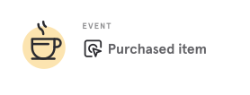
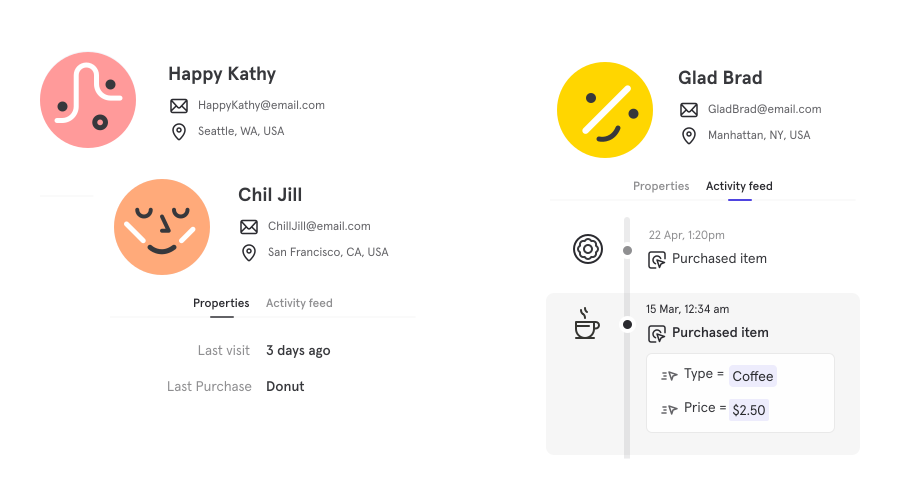
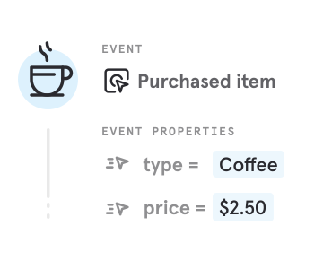
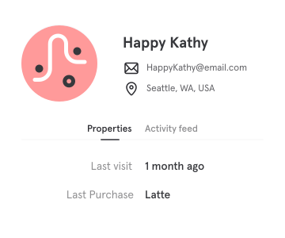

# What is Mixpanel?

Mixpanel will help you better understand your customers and answer questions about your product.
It enables you to track how users engage with your product and analyze this data with interactive reports
that let you query and visualize the results with just a few clicks.

Mixpanel is built on three key concepts: [**Events**](#events), [**Users**](#users), and [**Properties**](#properties).



## Concepts

Before you get started, you should know three Mixpanel concepts:

- **Events** are actions that happen in your product
- **Users** are the people who use your product
- **Properties** are the attributes of your users and events

### Events

An event is a data point that represents an interaction between a user and your product. Events can be a wide range of interactions.

Imagine you run a cafe where customers can purchase a coffee via an app. Each purchase is an event that can be tracked in Mixpanel.

### Users

On the other side of an event is a user — the specific individual who completed an interaction with your product.

Each user has a unique identifier that you can use to track their activity. This identifier can be an email address, a username, or a unique ID. Mixpanel uses a unique ID to identify users.

### Properties

You can track additional information about **users** and **events**. These details are called **properties**.

An **Event Property** describes an event. For a coffee purchase, the event would be _Purchased Item_ and the event properties could be _type_ (in this case a Coffee) and _price_ (in this case $2.50).

A **User Property** describes a User. This could be their name, email, age, etc.

Properties allow you to create groups of users (aka [cohorts](./users/cohorts.md)) and also enable you to filter for certain events or users. These
powerful features make it easy to identify trends and new customer insights.

## Next Steps

Now that you understand the basics, **we recommend planning the first events you would like to track**. This will help you understand what you need to get started. Choosing these events should take no more than 5 minutes.

<a href="./what-to-track.md" class="button primary">Plan Your Tracked Events</a>

  <h4 class="text-2xl font-medium mb-2 color:bg-purple200">
Already Know What You Want to Track?
  </h4>
  

If you already know the events you want to track, you can skip planning and
start by installing Mixpanel.
  

  <a href="./quickstart/install-mixpanel.md" class="button primary">Install Mixpanel</a>
