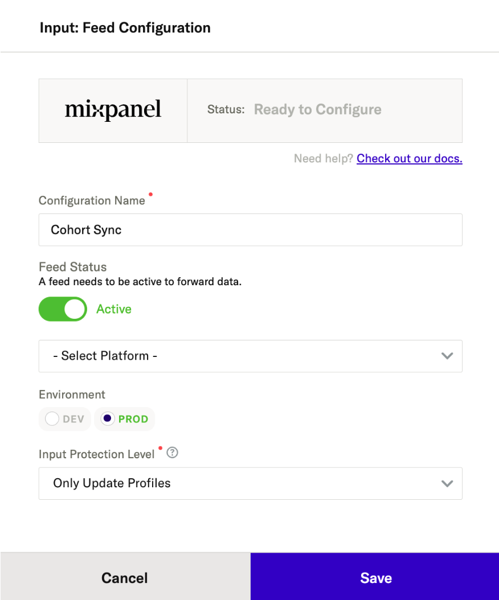
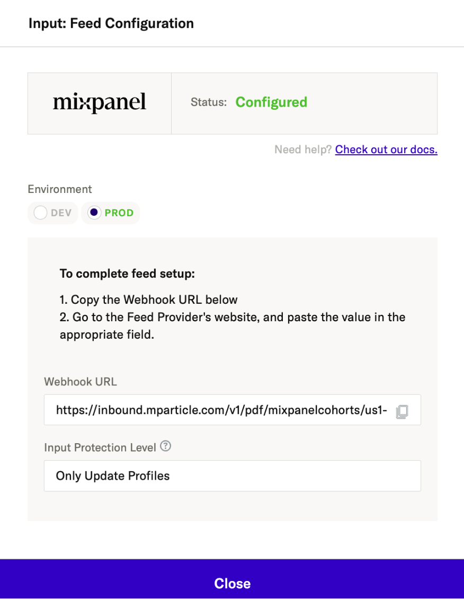
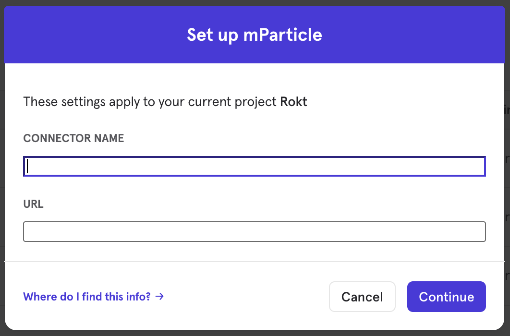
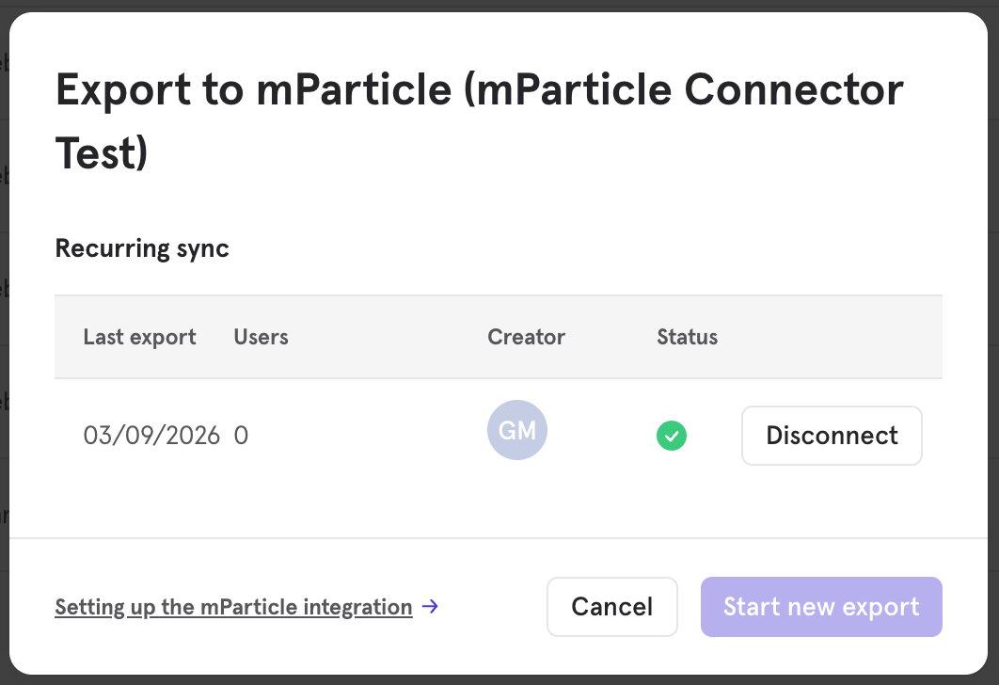
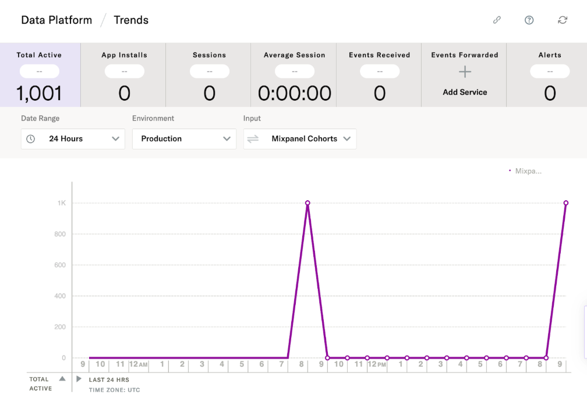
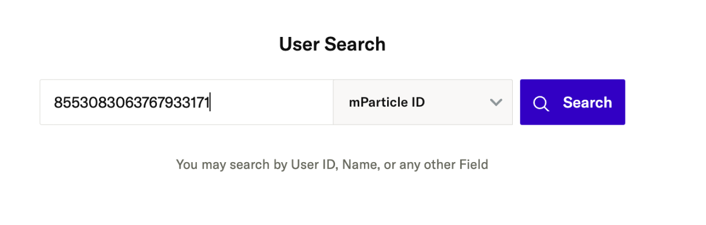

# mParticle

## Overview

This integration allows you to export Mixpanel Cohorts to [mParticle Feeds](https://docs.mparticle.com/guides/feeds/) to create [Audiences](https://docs.mparticle.com/guides/segmentation/audiences/overview/). This integration creates a user attribute in mParticle to represent cohort membership, which you can use to build or trigger [Audiences](https://docs.mparticle.com/guides/segmentation/audiences/overview/). By syncing your behavioral segments to mParticle, you can leverage Mixpanel’s deep analysis to power personalized experiences, targeted messaging, and audience suppression across the hundreds of downstream destinations supported by the mParticle CDP.

## Permissions

- **Mixpanel:** You must be a Mixpanel project admin to enable the mParticle integration.
- **mParticle:** You must have the necessary permissions in mParticle to create a Feed input and retrieve API credentials.

## Enable the Integration

This connection requires setup on both mParticle and Mixpanel.

### mParticle Setup

1. Log into your mParticle workspace.
2. Navigate to **Data Platform > Setup > Inputs**.
3. Select the **Feed** input type and search for **Mixpanel Cohorts**.

   

- Set Input Protection Level to Only Update Profiles to ensure only existing profiles can be updated and no new profiles will be created from cohort syncs.

4. Save and copy your **Webhook URL**.

   

### Mixpanel Setup

Mixpanel uses your mParticle API token to send data to the following endpoint:
`https://inbound.mparticle.com/v1/pdf/mixpanelcohorts/{{customer_api_token}}`

1. In Mixpanel, select **Integrations** under the **Data Management** tab in the top navigation bar.
2. Find **mParticle** in the list, click **Connect**, and paste your **mParticle Webhook URL** into the box.
3. Click **Continue** to establish the connection.

   

---

## Export a Cohort

To export a Mixpanel cohort to mParticle:

1. Navigate to **Cohorts** under the **Data Management** menu.
2. Find the cohort you wish to export, click the **three-dot overflow menu (...)**, and select **Export to... > mParticle**.
3. Select the sync type:
   - **One-Time Export:** A static snapshot of the cohort is sent immediately.
   - **Recurring (Dynamic) Sync:** Mixpanel will automatically update the audience in mParticle as users enter or exit the criteria.
4. Click **Start Sync**.

   

---

## Sync Types

### One-Time

In this sync, Mixpanel sends mParticle a static set of users who currently qualify for the cohort. The audience membership will not be updated in mParticle after this export.

### Dynamic (Recurring)

In a dynamic sync, Mixpanel initiates a sync every 15 minutes. Mixpanel sends "diffs" (adds and removes) to ensure that the user’s Audience membership in mParticle reflects their current state in Mixpanel.

---

## Setting $mparticle_user_id in Mixpanel

If you find that Mixpanel Cohorts are not properly matching again mParticle Cohorts, this is most likely because the primary identifier in mParticle is not set in Mixpanel’s user profiles. This is easy to connect using one of the two below methods

### Set $mparticle_user_id as a User Attribute via SDK (Recommended for Developers)

To ensure $mparticle_user_id appears as a specific property on the user profile, you can manually set it as a user attribute in your app's code. Since mParticle forwards all user attributes to Mixpanel (if "Include User Attributes" is enabled), this is the most reliable method.

Web SDK Example:

```
const currentUser = mParticle.Identity.getCurrentUser();
if (currentUser) {
    const mpid = currentUser.getMPID();
    currentUser.setUserAttribute("$mparticle_user_id", mpid);
}
```

iOS (Swift) Example:

```
if let currentUser = MParticle.sharedInstance().identity.currentUser {
    currentUser.setUserAttribute("$mparticle_user_id", value: currentUser.mpid.stringValue)
}
```

### Use mParticle Rules (No-Code)

If you cannot change your app's code, you can use mParticle Rules to automatically map the MPID to a user attribute before it is sent to Mixpanel.

Go to Data Plan > Rules in mParticle.

Create a new Rule for the Mixpanel Output.

Use the rule to copy the mpid from the batch level into the user_attributes object as $mparticle_user_id.

Logic: `batch.user_attributes['$mparticle_user_id'] = batch.mpid;`

Once the rule is active, every event sent to Mixpanel will include this attribute, and mParticle will update the Mixpanel People profile accordingly.

### Recommended Configuration Settings

For these connections methods to work as intended, ensure these toggles are active in your Mixpanel Connection Settings in mParticle:

Use Mixpanel People: Must be True (to enable user profiles).
Include User Attributes: Must be True (to ensure the custom $mparticle_user_id attribute is forwarded).
Create Profile Only If Logged In: Set to True (typically we will only want profile + cohorts based on known/authenticated users)

---

## How the Sync Works

### Identity Mapping

To ensure users are correctly matched in mParticle, Mixpanel maps identifiers in the following order of priority:

1.  `$mparticle_user_id`: If this property exists on the Mixpanel user profile, it will be used as the primary identifier.
2.  `$distinct_id`: If `$mparticle_user_id` is not present, Mixpanel falls back to the standard `$distinct_id`.

### Data Format

Mixpanel sets a user attribute in mParticle to represent cohort membership. This allows you to build or trigger [Audiences](https://docs.mparticle.com/guides/segmentation/audiences/overview/) within mParticle based on these attributes.

When a user enters a cohort, Mixpanel sends an update to set the attribute to `true`:

```json
{
  "user_attributes": {
    "<Cohort Name>": true
  }
}
```

When a user exits the cohort, Mixpanel updates the attribute to `false`:

```json
{
  "user_attributes": {
    "<Cohort Name>": false
  }
}
```

---

## Verifying in mParticle

Once the export begins, you can verify the data flow in mParticle:

### Generic validation

1. Navigate to **Data Platform > Trends** (or Live Stream if you are using dev data).
2. Select your Mixpanel input feed in the inputs dropdown to see of user profile updates received from the mixpanel cohort sync.

   

### User specific validation (requires org setup and user permission for user profile lookup)

1. In your Mixpanel cohort grab the Mparticle User id
2. Go to mParticle > Customer 360 > User Profiles and search the user

   

3. Check that the user has a user attribute with the name of your cohort.

---

## Troubleshooting

### Discrepancies in User Count

The most common cause for mismatched user counts is missing identifiers. If a user in the Mixpanel cohort does not have an `$mparticle_user_id` or a valid `$distinct_id` that matches a record in mParticle, the sync will not be able to update that user.

To check for eligible users in Mixpanel:

1. Go to the **Users** report.
2. Filter for your cohort.
3. Add a filter to check if `$mparticle_user_id` is set. This shows the maximum number of users likely to match via the primary ID.

### Export is Paused

If your sync is marked as **Paused** in the Mixpanel Integrations tab, hover over the status to see the error. This is usually caused by an invalid webhook url or a connection issue with the mParticle endpoint. You can typically resolve this by disconnecting and reconnecting the integration with a fresh API token.
