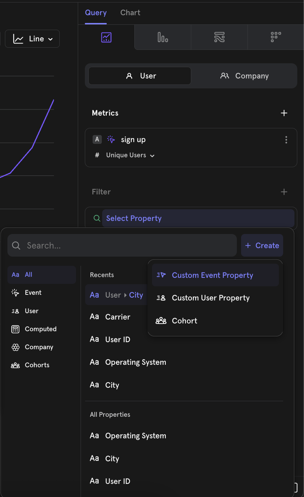
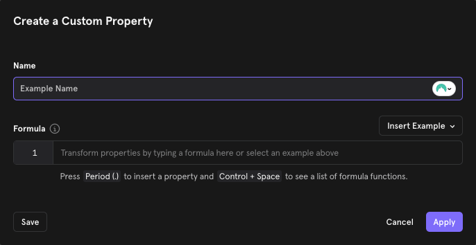
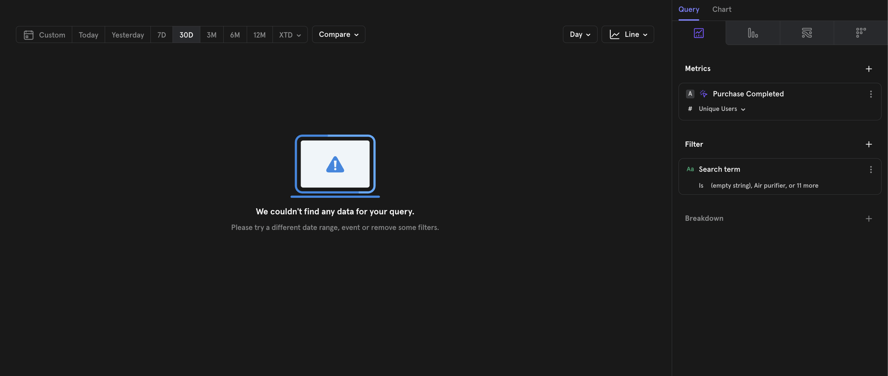
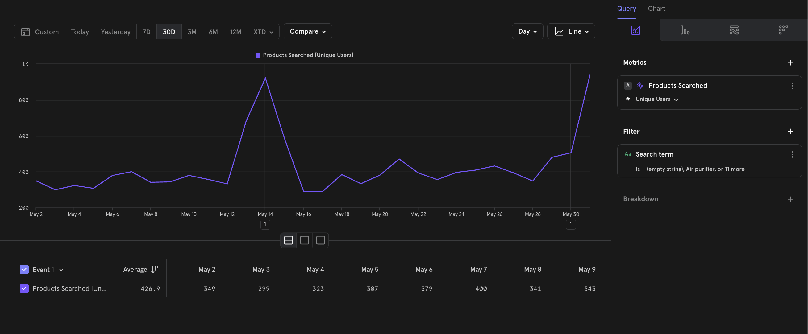
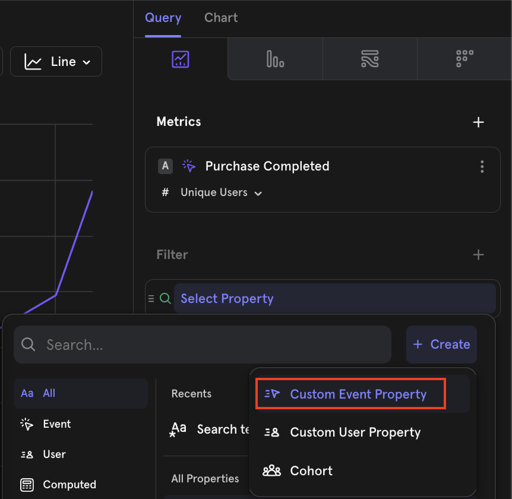
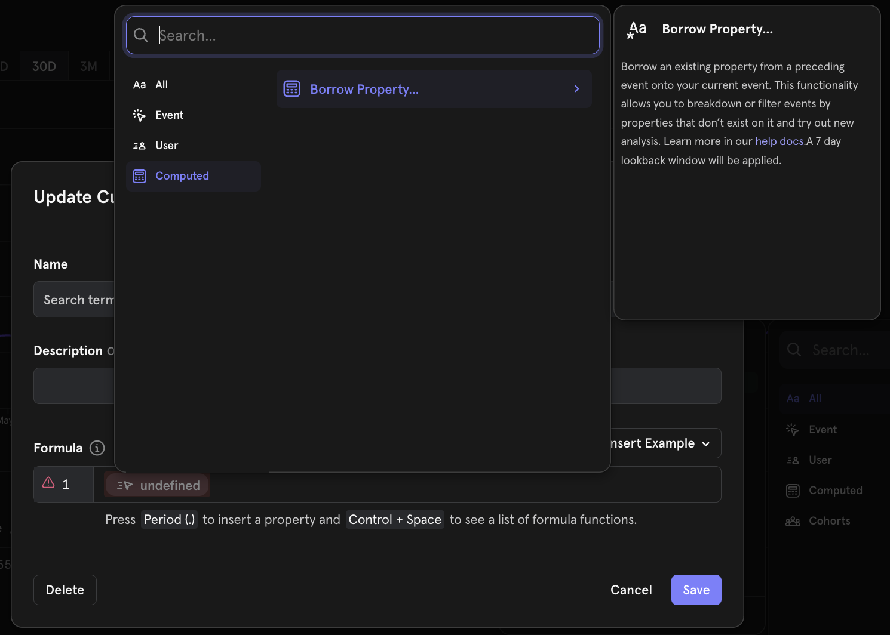
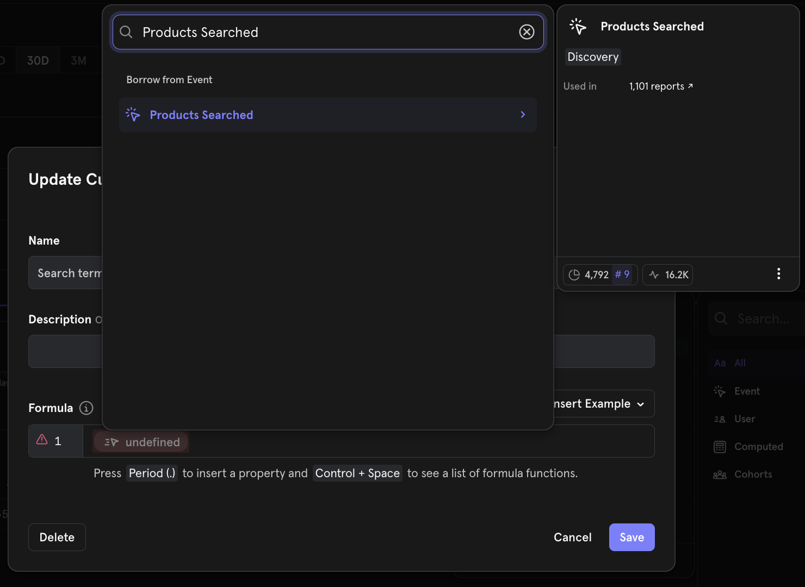
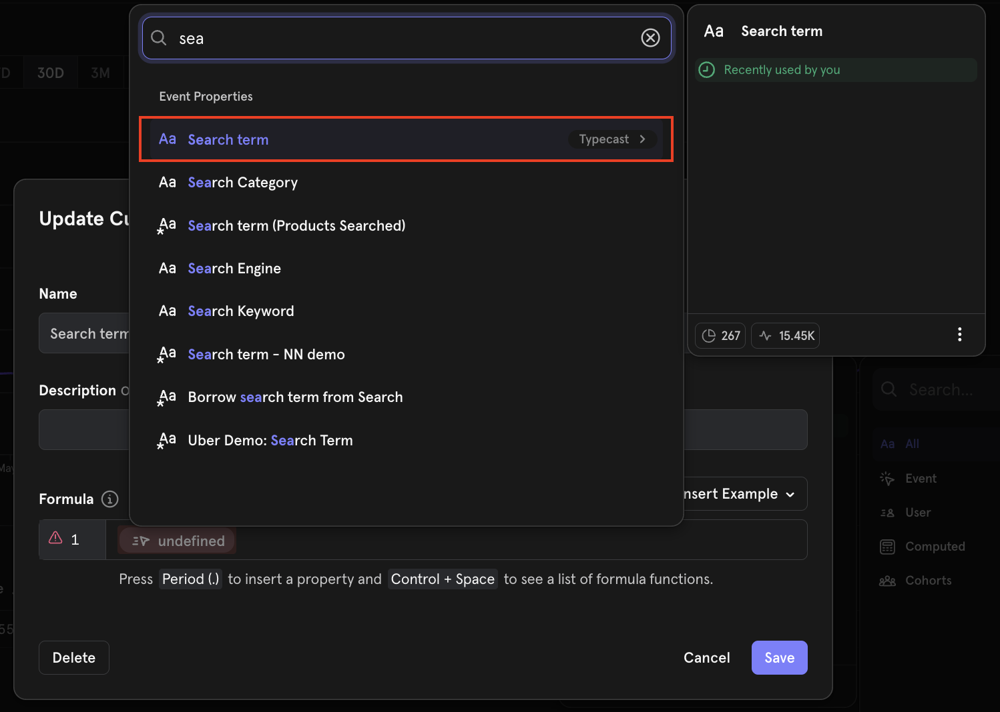

# Custom Properties: Calculate new properties on the fly


Free plan users can create custom properties locally within a report. Growth and Enterprise plan users can save the custom properties globally to reuse in other reports. See our [pricing page](https://mixpanel.com/pricing/) for more details.


## Overview

Custom properties let you combine existing properties into new properties on the fly, using a simple Excel-like formula language. You can then use these new properties almost anywhere that you can use regular properties, with the ability to save/share them for reuse across your team. For more on why we built this, check out [our blog](https://mixpanel.com/blog/introducing-the-mixpanel-modeling-layer/).

## Creating a Custom Property



## Click the plus button to the right of the search bar, then select either “Custom Event Property” or “Custom User Property” to open the property builder.




## Give your property a name.




## Click the formula bar to start defining the calculations to perform for your property.

If you're new to this feature, we recommend starting with one of the examples. Click the **Insert Example** drop down to populate the box with a use-case specific custom property.

When writing your formula, click **Ctrl + Space** to see a list of all the available [functions and their descriptions](./custom-properties.md#functions). Type **period (.)** to open the menu for choosing an event/profile properties to add to the custom property definition. 

If you are creating a “Custom Event Property” both event and user profile properties will be available to select. If you are creating a “Custom Profile Property” only user profile properties will be available for use in the custom property.


Note that the formula used to compose your custom property can't be longer than 20,000 characters.






## Saving and Reusing a Custom Property

Custom properties are local to the report by default when you select **Apply**. To save the custom property permanently for use in other reports and to make it usable by other project members, click **Save**. We recommend Applying the custom property and using it in your local analysis first, before saving and sharing, to reduce clutter in the project.

When you create custom properties and select **Save as Custom Property**, your created custom property will be private by default. You can also add a description at this stage, so you and your colleagues can know what the custom property is for. You can also decide to save the custom property and **share** that custom property with specific colleagues, teams, or the entire organization by clicking "**Save and Share**":

## Common Use Cases

**Grouping Marketing Channels**

If you're a marketer, using Mixpanel to show the impact of various channels on acquisition, you might want to group your UTM Sources into higher level buckets. For example:
* Facebook, Instagram, Twitter → Social
* Google, Bing → Search
* Everything else → Organic

You can also use the [Channel Classifier](/changelogs/2023-11-16-channel-classifier) template in custom properties as a starting point.

**Compute Properties Mathematically from Other Properties**

If you have an e-commerce app, you can combine "price" and "quantity" properties into a "total price" property as follows:

**Compute the Number of Days Between Two Date Properties**

Use custom properties to compute the date/time difference between two date properties. You can also use the special "TODAY()" function to find the difference between a date property and the current date/time. This is ideal when you want to transform a "DateofBirth" property into “age” or a "Created" property into “days active since registration”.

A new custom property can be defined by taking into account the “Created” property and using the following transformation:

**Compare Different Properties**

Use custom properties to create a new property if two property values are the same.

For example:

A company wants to find out what percentage of purchases are being made by users who have changed countries since signing up.

They can create a custom property to determine whether the two country values are the same with this transformation:

**Extract Domain from Email Address**

Extract the domain of the email from an email address. You can parse out parts of a string after "@" using the SPLIT function:

**Query a List with an Index**

Let's say you have a list of recommendations as a property, and you’d like to parse out the first recommendation as another string property.

You can parse out the first delivery ID in a list property with several DeliveryIDs:

The same syntax works with objects.

## Borrowed Properties

Borrowed properties allow you to take a property from a prior event and automatically add it as a property on a future event without needing to explicitly track the property in the future event.

**Use Cases:**

- Use client-side properties to populate a property on a server-side event. Example: “purchase” event could be a server-side event, while the “product search” event is a client-side event.
- Track a single event property and apply it to subsequent events. Example: It may be hard to track whether every event has dark mode enabled. You would need to keep track of the state of dark mode, and then add a “dark mode” property to every event that you track. Using borrowed events, you can just track one event with a property that indicates whether dark mode has been enabled or not, and have subsequent events borrow the property from that event.


Each project can use up to 20 borrowed properties.


### Creating Borrowed Properties

The following is a demonstration of Borrowed Properties using the [E-Commerce demo project](https://mixpanel.com/project/3018488), which anyone with a Mixpanel account can access.

In this demonstration, we present an event called **"Purchase Completed"**, which lacks the event property **"Search term"**. To enable a breakdown by **"Search term"**, we apply the Borrowed Property feature, leveraging the property from another event called **"Product Searched"**.



## Purchase Completed does not have “Search term”.




## Products Searched does have “Search term”.




## Create a custom event property.




## Add a borrowed property.




## Select an event to borrow from.




## Select the property to borrow.





### Borrowing Mechanics

Borrowed Properties capture the value from the most recent borrowed event.

We apply a seven-day lookback window, so the second event must occur within seven days of the first. If no first event exists within this window, the borrowed property is assigned the value (not set).

The video below demonstrates how to create a borrowed property.



Some key notes
- Borrowed property creation is limited to Admin & Owner Roles only
- A project can have a maximum of 20 borrowed properties. Hence, you are encouraged to only create borrowed properties useful to the larger team
- A borrowed property, once created, is like any other custom property. It can be accessed by all in the project, depending on permissions
- Borrowing of a property is strictly from the most recent event in the 7-day lookback window. To elaborate
- Say on event “purchase”, you want to borrow property “search term” from an event “search product”. If there are multiple events “search product” before “purchase”, the property will be borrowed from the most recent “search product” event where the property is set.
- Lookback is also fixed to a 7-day window. Say the “purchase” event occurred on 31st Jan, if the  most recent “search product” occurred on 20th Jan, the borrow functionality will return “search term” = (not set), since this event happened 11 days ago, which is outside the lookback window range.

To use a borrowed property with other [functions](./custom-properties.md#functions), you would need to: 

1. Create a custom property with just the borrowed property on its own

2. Create a separate custom property using the borrowed property (i.e., the 1st custom property)

3. Here's an example of a [report](https://mixpanel.com/s/1c4Pl9) with *Searched Category* custom property using *Search term (Products Searched)* borrowed property

## Reference

### Functions
