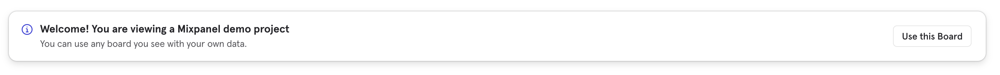

# Build User Flows

Use [Flows](https://app.gitbook.com/s/qGpd1uH02qXOCsOiKqLX/analysis/reports/flows) to help you identify the most frequent paths taken by users both to or from any event. It helps you understand how your users sequentially perform events in your product, and when they are most likely to drop off.



To follow along this tutorial, create a copy of [this board](https://mixpanel.com/project/3018488/view/3536632/app/boards/#id=6350517) from our demo project into the your own project. As you open the linked board, you will see instructions to click on "Use this board" to transfer it over to your project and to edit the default date range.

## Top Paths

Another way to visualize your flows is by seeing the [Top Paths](https://app.gitbook.com/s/qGpd1uH02qXOCsOiKqLX/analysis/reports/flows#top-paths). Condense the user flows down to unique paths on each row. This visualization is great for understanding the most common paths users take, though they may not be similar.
